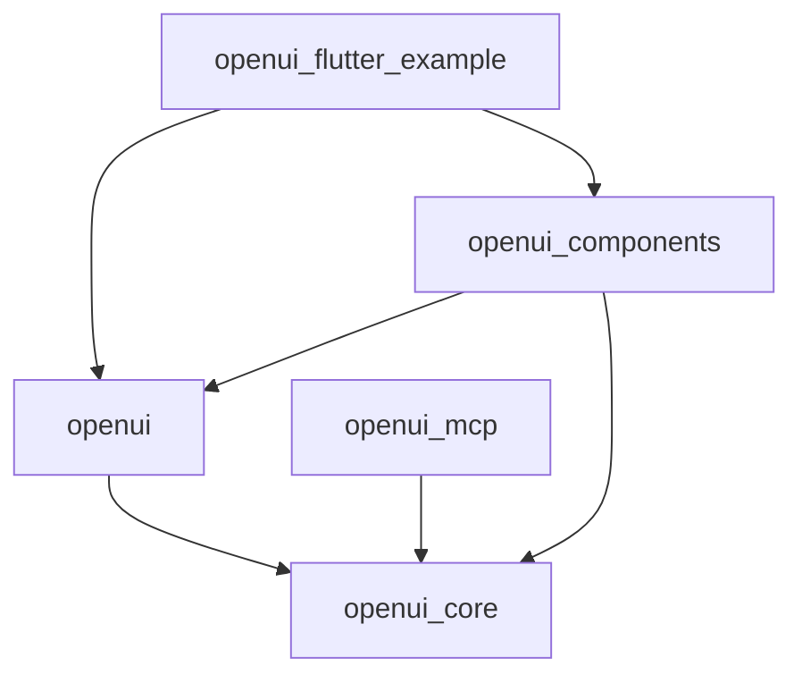
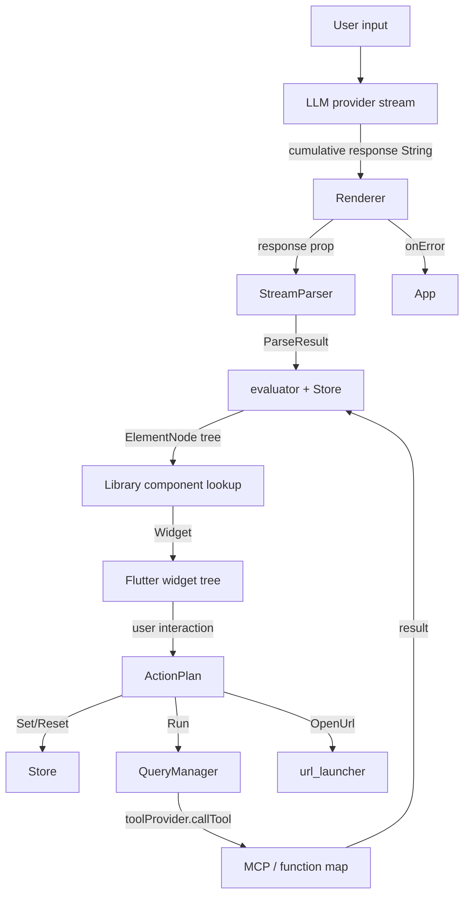

# Architecture

OpenUI Flutter is a four-package monorepo plus example app. The shape mirrors the JS reference at [thesysdev/openui](https://github.com/thesysdev/openui), with VGV layered-architecture conventions baked in.

## Package map

| Package | Type | Purpose |
|---|---|---|
| `openui_core` | pure Dart | OpenUI Lang lexer, parser, AST, evaluator, reactive store, library DSL, action steps, mergeStatements, tool-provider interface |
| `openui` | Flutter | `Renderer` widget, error boundary, form-state cache, query manager wiring |
| `openui_components` | Flutter | ~15 builtin widgets (Stack, Card, Form, Tabs, Table, charts, ...) |
| `openui_mcp` | pure Dart | `McpToolProvider` over `mcp_dart`; `extractToolResult` envelope |
| `openui_test_helpers` | pure Dart, private (publish_to: none) | Shared mocks and fakes |
| `openui_flutter_example` | Flutter app, private | Stubbed-LLM streaming chat demo |

## Dependency graph

The example app does not depend on `openui_mcp` in v0.1. A future variant
that demonstrates MCP integration will add the edge.

The graph is a DAG. Forbidden edges:

- `openui_core` cannot depend on Flutter, on any sibling package, or on `flutter_test`.
- `openui_mcp` cannot depend on Flutter or on `openui` / `openui_components`.
- `openui_components` cannot depend on `openui_mcp`.
- `openui` cannot depend on `openui_components` (the renderer must work with any library).

These are enforced by `tool/check_deps.dart` in CI (see decision D13).

## Data flow

## Public API discipline

Each package exports through a single barrel file `lib/<package>.dart`. Everything under `lib/src/**` is private. No individual `export 'src/foo.dart'` lines from the barrel — only specific symbols. Internal types stay internal even when crossing files within the package.

AST node types and `ParseResult` are exported from `openui_core` but marked `@experimental` (from `package:meta`). Their shape may change between v0.1 and v0.2.

## Layer boundaries

The dependency direction is strict. Concretely:

1. **Core layer** (`openui_core`, `openui_mcp`) is pure Dart. It runs in a server process, in a Flutter app, in a Cloudflare Worker — no Flutter imports.
2. **Renderer layer** (`openui`) is Flutter. It owns the `Renderer` widget plus the form-state cache and error boundary. It depends only on `openui_core`.
3. **Component layer** (`openui_components`) is Flutter. It depends on the renderer layer plus core. It is the policy layer that maps the OpenUI Lang component vocabulary to specific Flutter widgets.
4. **Application layer** (`openui_flutter_example`) is Flutter. It depends on everything; consumers replace it.

A `Renderer` rendering output for an LLM that emits an unknown component name does not break — the unknown component falls into `meta.unresolved` and the renderer either shows nothing or a placeholder, depending on `onError` wiring.

## State management

Per Decision D4, one `Store` instance per `Renderer`. The store is backed by `ChangeNotifier` and lives inside `_RendererState`. Dispose is automatic.

Chat/state management is app-owned. The example app wires `dartantic` streaming into Bloc and forwards cumulative text into `Renderer`.

## Streaming model

`Renderer` accepts `response: String` and `isStreaming: bool`. On every change to `response`, the renderer pushes the diff into its `StreamParser`. The parser splits the buffer at the last bracket-depth-zero newline; the prefix's `ParseResult` is cached, the suffix is re-parsed on every chunk. `autoClose()` injects synthetic closing quotes/brackets so a partial line is renderable.

While streaming, components in incomplete statements have their tap targets disabled (Acceptance Gap A6). The error boundary caches the last successful child so that a transient parse-error mid-stream does not blank the screen.

## Form state lifecycle

The form-state cache lives in the `Renderer`, not in `Form` widgets. Key: `(formName, fieldName)`. When a field disappears from the parsed tree, its `TextEditingController` is retained for 250 ms (Decision D7). The 250 ms grace absorbs the LLM deleting and re-adding the same field as it streams.

## Testing strategy

Each package has a parallel `test/` directory. Logic gets unit tests; widgets get widget tests (`flutter_test`); per-adapter SSE captures are stored as fixtures and replayed.

The example app has integration tests driven from cold start through pre-recorded stub scripts; the rendered tree is asserted against goldens.

100% line coverage on logic, enforced by `very_good_coverage`. Unreachable platform branches use `// coverage:ignore-line` with a one-line justification (Decision D14).

## CI shape

One workflow file per package under `.github/workflows/<package>.yml`, using `very_good_workflows`'s reusable workflows. Path filters scope each workflow to its package. Linux runs unit and widget tests; macOS runs the integration test that drives the example app on iOS simulator.

`crate-ci/typos` runs at the repo level against `_typos.toml`. Semantic PR title is checked at the repo level via `amannn/action-semantic-pull-request`.
