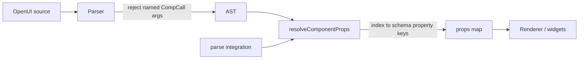

# Positional component args (canonical parity)

## What We're Building

Close the **positional vs named component args** gap documented in [canonical-comparison.md](../canonical-comparison.md) so OpenUI Lang programs use **positional-only** component calls on the primary render path, matching canonical v0.5.

Today:

- The **parser** accepts both positional and named args (`Argument.name == null` vs `ident: expr`).
- **Integration `parse()`** maps positional args to props by `ParamMap` index order.
- **`evaluateElementProps` / `Renderer`** drop positional args (`if (propName == null) continue`).
- **Prompts and examples** teach `Type(named: value, …)`.

Target:

- **Positional-only** for component calls: `TextContent("Hello", "large-heavy")`, `Stack([a, b], "row")`.
- **Hard break**: `label: "x"` in component arg lists is a **parse error** (not a silent ignore).
- **Lenient positional binding**: map positionals to schema property order by index; **ignore** extra positionals; apply schema defaults for missing optional props.
- **Full surface**: render path, prompts, example `.txt` assets, and `lang-reference.md` updated together.
- **Param order (phase 1)**: use **current Dart `Schema.object` property insertion order** as the positional slot order; reorder schemas to match canonical Zod order in a **follow-up** (known interim gap).

**Out of scope** (separate parity items in canonical-comparison): `action` vs `onClick`, `Action([...])` wrapper, `Query(...)` statement form, array pluck, additional builtins.

### Known limitation until schema reorder (phase 2)

Phase 1 ships **positional syntax + mapping machinery** using **Dart schema key order**, not canonical Zod order. Canonical paste can still bind the wrong props.

Example — `Stack`:

| | First positional slot |
|--|----------------------|
| Canonical | `children` |
| Flutter schema today (`stack.dart`) | `direction` |

So this canonical line:

```text
controls = Stack([incBtn, resetBtn], "row")
```

binds `[incBtn, resetBtn]` to **`direction`**, not `children`, until `Stack`'s `Schema.object` properties are reordered to match `openuiLibrary.tsx`.

**Phase 2 follow-up:** reorder `properties` maps (or add explicit order) per shipped component per [canonical-comparison.md](../canonical-comparison.md) §5.3; add golden tests that paste canonical `openuiExamples` snippets.

Components where Dart order likely already matches canonical (verify in plan): `TextContent` (`text`, `size`), `Table` / `Col` (verify against TS definitions).

## Why This Approach

Three implementation strategies were considered:

**Approach A — Unify in `library.dart` (chosen)**

Add a shared `resolveComponentProps(call, schema, context)` that:

1. Builds ordered param names from `schema.value['properties']` key iteration order.
2. Maps positional args by index (lenient: stop at property count, ignore excess).
3. Applies `x-reactive` / `x-action` special cases to the **prop name** resolved at each index (same rules as today, regardless of how the arg was written).
4. Is used by `evaluateElementProps`, `Renderer._resolveProps`, and refactored `parse()` `_materializeComp` (remove the dead "named args layer on top" loop in `_materializeComp` once the parser rejects named `CompCall` args).

- Pros: one code path for production render and integration parse; fixes the documented test `positional args are dropped`.
- Cons: `parse()` today uses `ParamSpec` for `required` / `defaultValue`; must either derive defaults from schema JSON or keep a thin `ParamSpec` overlay for validation-only.
- Best when: we want renderer parity without duplicating `_materializeComp` forever.

**Approach B — Port `parse.dart` logic only**

Copy the positional loop from `_materializeComp` into `evaluateElementProps`; leave `parse()` unchanged.

- Pros: smallest diff.
- Cons: two divergent implementations again; `ParamMap` vs schema order drift.
- Best when: emergency fix. Rejected.

**Approach C — `ParamSpec` on every `ComponentDefinition`**

Explicit ordered param list per component; single source of truth; golden tests vs canonical Zod order.

- Pros: clearest canonical alignment long-term.
- Cons: more boilerplate now; duplicates schema unless generated.
- Best when: schema key order is unreliable. Deferred — user chose Dart schema order for phase 1.

**Compatibility options considered:**

| Option | Decision |
|--------|----------|
| Both positional + named | Rejected → **positional-only** |
| Deprecation window for named | Rejected → **hard break** |
| Strict excess/missing validation | Rejected → **lenient** (map what fits, ignore extras, defaults for optional) |
| Canonical Zod property order now | Rejected → **Dart schema order now**, canonical order later |

## Key Decisions

1. **Syntax: positional-only component calls** — Named args (`prop: expr`) in component arg lists are rejected at **parse time** with a clear error (e.g. `named component arguments are not supported; use positional args in schema order`).

2. **Render path: map positionals, do not drop them** — Replace the `if (propName == null) continue` behavior in `evaluateElementProps` with index-based binding to schema property keys in insertion order.

3. **Lenient binding** — Extra positional args beyond the property count are **silently ignored** (no `excess-args` / `EvaluationError`). This **changes** integration `parse()` today, which reports excess-args but still renders (`parse_test.dart` `excess-args` group). Missing optional props use schema / `ParamSpec` defaults. **Missing required** props: keep today's integration `parse()` behavior (`missing-required` `EvaluationError`, drop element if fatal).

4. **Hard migration** — All in-repo prompts (`prompt.dart`), example scripts under `apps/openui_flutter_example/assets/scripts/`, and `lang-reference.md` switch to positional-only in the same change. No deprecation period.

5. **Shared resolver in `library.dart`** — `parse()` `_materializeComp` delegates to the same helper to avoid dual behavior (fixes the split where `parse()` maps positionals but `Renderer` does not).

6. **Param order phase 1 = Dart schema insertion order** — Accept that canonical programs using canonical Zod order may mismatch bindings until schemas are reordered (documented follow-up). Add a checklist test or table in plan phase comparing canonical vs Dart order per shipped component.

7. **Builtins and actions unchanged** — `@Query`, `@Each`, `@Run`, etc. keep their existing positional/named rules. Only **`CompCall` / component** arg lists are positional-only; `ident: expr` remains valid inside builtin calls, object literals, and `Mutation` args.

8. **`x-action` / reactive via positional** — e.g. `Button("OK", [@Set($x, 1)], "primary")` binds the action array to whichever prop occupies that index in schema order (`onClick` today; `action` when prop parity lands).

## Implementation sketch (for planning)



**Files likely touched:**

| Area | Path |
|------|------|
| Shared resolver | `packages/openui_core/lib/src/library/library.dart` |
| Renderer | `packages/openui/lib/src/renderer.dart` |
| Parse integration | `packages/openui_core/lib/src/parse/parse.dart` |
| Parser error | `packages/openui_core/lib/src/parser/expressions.dart` (or `parser.dart`) |
| Tests | `library_test.dart`, `parse_test.dart`, renderer/widget golden tests |
| Prompts | `packages/openui_core/lib/src/prompt/prompt.dart` |
| Docs | `docs/lang-reference.md`, `docs/canonical-comparison.md` (status update) |
| Examples | `apps/openui_flutter_example/assets/scripts/*.txt` |

**Test plan highlights:**

- Flip `positional args are dropped` → `positional args bind by schema order`.
- Parser rejects `Button(label: "x")` with actionable error.
- `TextContent("hi", "large-heavy")` resolves `{text, size}` through `evaluateElementProps` and full `Renderer`.
- `parse()` and `evaluateElementProps` agree on the same props map for identical AST.
- Remove or rewrite `parse_test.dart` `excess-args` expectations (no error on extra positionals).
- Example scripts parse and render without named component args.
- Document Dart vs canonical slot order table for all 17 shipped components (plan artifact).

## Open Questions

1. **Parse error code** — Add `named-component-arg` (recommended) vs generic parse error; align message with canonical spec wording.

2. **Schema reorder follow-up** — Separate PR/issue; per-component table from `canonical-comparison.md` §5.3.

## References

- [canonical-comparison.md](../canonical-comparison.md) — §2.1, §3.4, §8 phase 1
- [OpenUI Lang v0.5 spec](https://www.openui.com/docs/openui-lang/specification-v05) — positional-only component args
- Existing mapping: `packages/openui_core/lib/src/parse/parse.dart` `_materializeComp`
- Gap: `packages/openui_core/lib/src/library/library.dart` `evaluateElementProps`
