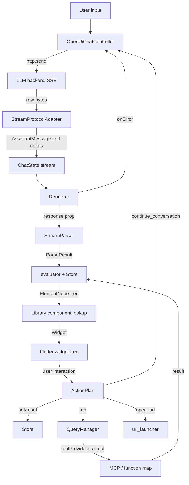

## Port OpenUI to Flutter — Extensive

## Overview

Build a feature-faithful Flutter port of [OpenUI](https://www.openui.com) — Thesys's open standard for generative UI. LLMs stream a small declarative language (OpenUI Lang) and the runtime renders it incrementally as native Flutter widgets. The port targets parity with the JavaScript reference at [thesysdev/openui](https://github.com/thesysdev/openui): a streaming parser, reactive `$state` store, builtins (`@Count`, `@Filter`, `@Each`, `@Map`), `Query` and `Mutation` tool calls, the `ActionPlan` system (`@Set`, `@Reset`, `@Run`, `@ToAssistant`, `@OpenUrl`), and a ~15-component MVP widget library.

The deliverable is a Melos-managed monorepo of five pub.dev-publishable Dart and Flutter packages plus a stubbed-LLM example app demonstrating end-to-end streaming chat.

## Problem Statement

There is no Flutter implementation of OpenUI today. Teams using Flutter that want LLM-driven UIs either build bespoke widget pipelines or accept the JS-only reference. The JS reference's separation between language core, renderer, chat, components, and MCP is the right shape for Flutter, but Dart's type system, schema tooling, and SDK story differ enough that a literal transliteration is not sufficient. Specific gaps the port must close:

1. **No Dart equivalent to Zod-tagged JSON Schema** — the JS lib uses Zod 4 with a custom `WeakSet` for reactive marking and `WeakMap` for component naming. Dart's `json_schema_builder` (v0.1.3) is the closest fit but is preview-quality and may strip extension keywords.
2. **Streaming primitives differ** — the JS lib uses Web `ReadableStream`. Flutter targets must work on mobile (`dart:io`) and web (`package:http` browser client), each with different SSE behavior. Web buffers SSE responses by default.
3. **MCP tooling is a shifting target** — `mcp_dart 2.1.1` exists but `Content` is sealed, so the JS `extractToolResult` shape needs a Dart helper. `dart_mcp 0.5.1` (Flutter Labs) is competing.
4. **Form state and reactive store lifecycle** must integrate with Flutter widget lifecycles, not React's. Controllers leaking on re-render is the dominant streaming-UI bug.
5. **Action timing semantics are subtle** — `@Set($count, $count + 1)` must read store state at click time, not parse time. The JS reference already preserves the unevaluated AST through `valueAST`. The Dart port must do the same.

The goal is a production-quality port that any Flutter team can drop in, with tests and docs strong enough that a contributor can fix a parser bug without reading the JS source.

## Proposed Solution

A five-package monorepo plus example app, scaffolded on Melos 7 over native Dart pub workspaces, mirroring the JS layered architecture with VGV conventions baked in.

```
openui_flutter/
├── packages/
│   ├── openui_core/         # pure Dart: lexer, parser, AST, evaluator, store, library DSL
│   ├── openui/              # Flutter: Renderer widget, error boundary, form-state cache
│   ├── openui_chat/         # pure Dart: ChatController, SSE adapters, message format
│   ├── openui_components/   # Flutter: ~15 builtin widgets (Stack, Card, Form, charts, etc.)
│   └── openui_mcp/          # pure Dart: McpToolProvider over mcp_dart
├── apps/
│   └── openui_flutter_example/   # Flutter app, stubbed-LLM streaming chat demo
├── packages/openui_test_helpers/ # private (publish_to: none), shared mocks/fakes
├── pubspec.yaml             # workspace root + melos config
├── melos.yaml               # OR melos block in root pubspec
└── .github/workflows/       # one workflow per package using very_good_workflows
```

Phase 0 resolves architectural decisions via two short spikes (`json_schema_builder` keyword preservation and a streaming-parser walking skeleton) before any consumer work. Phase 1 builds `openui_core` end-to-end against contract tests derived from the JS reference behavior. Phase 2 builds `openui` (renderer + form-state cache + error boundary). Phase 3 builds `openui_components` and `openui_chat` in parallel. Phase 4 builds `openui_mcp` and the example app, then polishes docs, accessibility, and CI for v0.1.0 publish.

## Technical Approach

### Architecture

#### Package responsibilities and boundaries

| Package | Type | Depends on | Public surface |
|---|---|---|---|
| `openui_core` | `dart_package` | `json_schema_builder` (or wrapper), `meta` | `parse`, `createStreamingParser`, `evaluate`, `Library`, `defineComponent`, `Store`, `mergeStatements`, `ToolProvider`, `extractToolResult`, AST + ParseResult types |
| `openui` | `flutter_package` | `openui_core`, `flutter` | `Renderer` widget, `OpenUIError`, `ComponentRenderer` typedef |
| `openui_chat` | `dart_package` | `openui_core`, `http`, `sse_channel` (web only via conditional import) | `OpenUiChatController`, `Message`, `ChatState`, `StreamProtocolAdapter` (typedef, not class), `MessageFormat`, four built-in adapters |
| `openui_components` | `flutter_package` | `openui`, `openui_core`, `flutter_markdown_plus`, `fl_chart`, `url_launcher` | `openuiLibrary()`, `openuiChatLibrary()`, individual `Component` definitions |
| `openui_mcp` | `dart_package` | `openui_core`, `mcp_dart` | `McpToolProvider`, `McpClientAdapter` |

Dependency direction is strict and enforced via per-package `analysis_options.yaml` with `avoid_relative_lib_imports` plus a CI rule that runs `dart pub deps --json` and fails on disallowed back-edges.

**Public API discipline (every package).** The barrel file at `lib/<package>.dart` is the only file consumers import. Everything under `lib/src/**` is private; no implementation file under `src/` is `export`ed individually from the barrel. Internal types stay internal, even when crossing files within the package, to keep the published surface auditable. AST node types and `ParseResult` are exported from `openui_core` but marked `@experimental` (via `package:meta`) — their shape may change between v0.1 and v0.2.

#### OpenUI Lang grammar (ported)

```
program       ::= statement* EOF
statement     ::= identifier "=" expression NEWLINE
identifier    ::= IDENT | TYPE | STATEVAR
expression    ::= comp_call | builtin_call | ternary | binary_op | unary_op
                | member_access | index_access | state_assign | literal
                | array | object | reference
comp_call     ::= TYPE "(" arg_list ")"
builtin_call  ::= "@" IDENT "(" arg_list ")"
state_assign  ::= "$" IDENT "=" expression
state_ref     ::= "$" IDENT
literal       ::= STRING | NUMBER | "true" | "false" | "null"
```

Statements are classified at parse time as `value`, `state`, `query`, or `mutation`. Query is checked before state because `$foo = Query(...)` must be a query, not a state binding.

#### Streaming parser

`createStreamingParser(library, rootName?)` returns a `StreamParser` with two methods:

- `push(String chunk) → ParseResult` — append, return latest parse
- `set(String fullText) → ParseResult` — replace buffer, diff against prior, return latest parse

Internal state: a `String` buffer split at the last bracket-depth-zero newline into a "completed" prefix and a "pending" tail. Completed statements are cached and only re-parsed when changed (textual hash). The pending tail is re-parsed every chunk after passing through `autoClose()`, which inserts synthetic closing quotes/brackets so any partial line is renderable.

Matches JS reference behavior: forward references hoist (`root = Stack([chart])` may appear before `chart = ...`); unresolved entries land in `meta.unresolved`; partial element nodes are flagged `partial: true`.

#### Reactive store and `$state`

`Store` interface:

```dart
abstract class Store {
  Object? get(String key);
  void set(String key, Object? value);
  VoidCallback subscribe(VoidCallback listener);
  Map<String, Object?> getSnapshot();
  void initialize(Map<String, Object?> defaults, [Map<String, Object?>? persisted]);
  void dispose();
}
```

Implementation backed by `ChangeNotifier` + `Map<String, Object?>`. `set()` does shallow-equality short-circuit before notifying. `initialize()` never overwrites user-modified bindings — applies persisted first, defaults only for absent keys. Match JS semantics.

Reactive prop binding: `PropSchema.reactive(inner)` wraps a JSON Schema with the `x-reactive: true` extension keyword. The evaluator's `evaluateProp()` checks the schema for `x-reactive` and emits a `ReactiveAssign(target: '$varName', value: <currentValue>)` marker instead of resolving immediately. Components consuming the prop check via `isReactiveAssign()` and set up two-way binding.

#### Action timing

`@Set` and `@Reset` carry their unevaluated AST through to dispatch. The action plan dispatcher receives the live store and re-evaluates `valueAST` at click time. This matches the JS reference and is required for `@Set($count, $count + 1)` to work correctly.

`ActionStep` shapes:

```dart
sealed class ActionStep {}
class RunStep extends ActionStep { final String statementId; }
class ContinueConversationStep extends ActionStep { final String message; final String? context; }
class OpenUrlStep extends ActionStep { final String url; }
class SetStep extends ActionStep { final String target; final AstNode valueAst; }
class ResetStep extends ActionStep { final List<String> targets; }
```

`ActionPlan { List<ActionStep> steps }` is the wrapper. Steps execute sequentially; mutations halt the plan on failure.

#### Renderer widget and form-state cache

`Renderer` is a `StatefulWidget` that owns:

- The streaming parser
- The reactive store (per-Renderer)
- A `_FormStateCache` keyed by `(formName, fieldName)` holding `TextEditingController`s
- A last-good `Widget?` cache for the error boundary
- A simple `Map<String, Future<Object?>>` query-result cache keyed by `statementId` (no dependency tracking in v0.1; `@Run` invalidates by id and re-fires)

Critical: the form-state cache is owned by the `Renderer`, not by child widgets. When a `Form` rebuilds because the LLM appended a new field, existing controllers persist (focus and cursor preserved). Controllers are disposed only when the field disappears from the parsed tree for a debounce interval (250 ms) — the JS reference's "stable" check.

API mirrors React `<Renderer />`:

```dart
class Renderer extends StatefulWidget {
  final String? response;
  final Library library;
  final bool isStreaming;
  final void Function(ActionEvent)? onAction;
  final void Function(Map<String, Object?>)? onStateUpdate;
  final Map<String, Object?>? initialState;
  final void Function(ParseResult?)? onParseResult;
  final ToolProvider? toolProvider;
  final QueryLoader? queryLoader;
  final void Function(List<OpenUIError>)? onError;
  final Widget? queryLoadingPlaceholder;
}
```

#### Streaming-tolerant error boundary

Each component is wrapped in a `_ErrorBoundary` widget that caches its last successful child. On a render-time exception, it shows the cached child and pushes the error to `onError`. The next successful `build()` clears the cache (Flutter's synchronous build means a single non-throwing render is definitive; the JS reference's three-frame counter is a React-concurrent-rendering concern). Form state lives outside this cache and is invalidated on `onStateUpdate`.

#### Chat layer

`OpenUiChatController` is a plain Dart `ChangeNotifier`-style class:

```dart
class OpenUiChatController {
  Stream<ChatState> get state;
  List<Message> get messages;
  bool get isRunning;

  Future<void> sendMessage(String text);
  void cancelMessage();
  Future<void> handleAction(ActionEvent event, Store store);
  void dispose();
}
```

It does not depend on `flutter_bloc`, `provider`, or `riverpod`. Consumers wire `controller.state` into whatever state-management they prefer. Each `sendMessage` allocates its own `http.Client`; `cancelMessage` closes only that client. Bytes flow through `Utf8Decoder(allowMalformed: true)` (not `false` as the brainstorm initially suggested — a malformed byte mid-stream must not throw and kill the message).

Stream adapters (v1):

| Adapter | Wire format | Use case |
|---|---|---|
| `agUiAdapter()` | SSE, JSON-encoded `AGUIEvent` per `data:` line | Default, matches `@ag-ui/core` reference backend |
| `openAICompletionsAdapter()` | OpenAI Chat Completions SSE delta | Direct OpenAI integration |
| `openAIResponsesAdapter()` | OpenAI Responses API SSE | Newer OpenAI Responses API |
| `plainSseAdapter()` | SSE with raw text deltas | Custom backends + example app |

The brainstorm proposed three; flow analysis flagged that the JS reference ships five (`agUI`, `openai-completions`, `openai-responses`, `openai-readable-stream`, `langgraph`). Decision: ship the four above in v0.1; defer `langgraph` and `openai-readable-stream` to v0.2 unless a user files issues. This is recorded in [Acceptance Gap A21](#acceptance-gaps).

Adapter selection is explicit (constructor parameter), and each adapter throws `AdapterMismatchError` on the first malformed event with the adapter name in the message. No silent failure.

#### Components library

Implemented in `openui_components`:

| Component | Implementation notes |
|---|---|
| Stack | `Flex` with `direction`, `gap`, `align`, `justify`, `wrap` props. Defaults: `direction='column'`, `gap='m'` |
| Card, CardHeader | `Card` widget with `variant: 'card'\|'sunk'\|'clear'` |
| TextContent | `Text` with semantic size variants (`large-heavy`, `medium`, `small`, etc.) |
| MarkDownRenderer | `flutter_markdown_plus`, `MarkdownBody`, debounce 16 ms while streaming |
| Callout | Banner with leading icon, color variants |
| Image | `Image.network` with `errorBuilder` placeholder |
| Table + Col | Custom paginated DataTable, page size 10 |
| Tabs + TabItem | `DefaultTabController` + `TabBarView` |
| Form + FormControl + Input + Select + Button + Buttons | Material text fields, dropdowns, buttons. Wired to renderer's form-state cache |
| Separator | `Divider` |
| CodeBlock | Monospace `Container` with `SelectableText`. No syntax highlighting in v1 |
| BarChart, LineChart | `fl_chart`, multi-series + stacked support, animations disabled during streaming |

`openuiLibrary()` returns a `Library` with no root; `openuiChatLibrary()` wraps every response in a `Card`, matching the JS reference.

#### MCP integration

`openui_mcp` exposes:

```dart
class McpToolProvider implements ToolProvider {
  McpToolProvider(this.client);
  final McpClient client;

  @override
  Future<Object?> callTool(String name, Map<String, Object?> args) async {
    final result = await client.callTool(CallToolRequest(name: name, arguments: args));
    return _extractToolResult(result);
  }
}
```

`_extractToolResult(CallToolResult)` is the Dart port of JS `extractToolResult`. It handles the sealed-`Content` cast (`mcp_dart 2.1.1` returns `List<Content>` where the concrete type is usually `TextContent`):

1. `result.isError == true` → join all `TextContent.text` fields, throw `McpToolError(message)`
2. `result.structuredContent != null` → return `result.structuredContent`
3. Else → filter `Content` for `TextContent`, join, attempt `jsonDecode`, fall back to raw string

#### `mergeStatements` (edit mode)

Port the JS `mergeStatements(existing, patch, rootId = 'root') → String`:

1. Parse both inputs; treat `patch` as preprocessed (strip fences first).
2. If `existing` empty, return `patch.raw.join('\n')`.
3. If `patch` empty, return `existing` unchanged.
4. Build `Map<id, raw>`, `Map<id, ast>`, ordered `List<id>` from existing.
5. For each patch statement: if `ast.kind == NullLiteral`, delete; else upsert and append-if-new.
6. Run `_gcUnreachable(order, merged, asts, rootId)` to drop orphans.
7. Return `order.where((id) => merged.containsKey(id)).map((id) => merged[id]).join('\n')`.

#### Pubspec workspace and Melos config

Root `pubspec.yaml`:

```yaml
name: openui_flutter
publish_to: none
environment:
  sdk: ^3.9.0
workspace:
  - packages/openui_core
  - packages/openui
  - packages/openui_chat
  - packages/openui_components
  - packages/openui_mcp
  - packages/openui_test_helpers
  - apps/openui_flutter_example
dev_dependencies:
  melos: ^7.7.0
  very_good_analysis: ^10.2.0
melos:
  scripts:
    analyze: { exec: dart analyze --fatal-infos }
    format: { exec: dart format --set-exit-if-changed . }
    test: { exec: dart test --coverage=coverage }
    test:flutter: { exec: flutter test --coverage }
```

Each sub-package adds `resolution: workspace` to its `pubspec.yaml`.

### Data flow



### Implementation Phases

#### Phase 0: Spikes and decisions (3-5 days)

Resolve architectural unknowns before scaffolding consumer packages.

- [ ] **Spike S0.1: `json_schema_builder` extension preservation.** Build a 50-line script in a throwaway package. Construct `S.object({'children': S.list(S.string())})`; manually merge `{'format': 'openui-component', 'x-reactive': true}` into the resulting `Map`; serialise; round-trip through a parser. Confirm whether a thin wrapper is needed or `toJson()` + `..addAll()` is enough. Output: a one-page decision note in `docs/spike-results/`.
- [ ] **Spike S0.2: streaming parser walking skeleton.** Build a tokenizer + minimal parser in pure Dart that handles `name = StringLiteral` and `name = Component(arg, arg)` only. Feed byte-by-byte through `Utf8Decoder(allowMalformed: true)`. Confirm the design for `autoClose()` (insert close quotes, brackets) before going wider. Land as `packages/openui_core/lib/src/parser/lexer.dart` + a contract test.
- [ ] **Spike S0.3: `mcp_dart` envelope shape.** Run `mcp_dart 2.1.1` against a local MCP echo server. Confirm `CallToolResult.content[0]` is `TextContent` and `.text` is a JSON string in the typical case. Document the exact cast helper.
- [ ] **Phase 0 decision register** — write `docs/decisions/2026-05-10-phase0-decisions.md` resolving:
  - Parser keying: pure function `(response, library, rootName?) → ParseResult`; cache keyed by `(response.length, library.id, rootName)`.
  - Action `$var` resolution: at dispatch (click) time, against current store.
  - Reactive store scope: per-`Renderer` instance.
  - Adapter selection: explicit, throw `AdapterMismatchError` on first malformed event.
  - UTF-8 policy: `allowMalformed: true` with warn-level log.
  - Form controller cache: per-`Renderer`, keyed by `(formName, fieldName)`, 250 ms grace before disposal.
  - Query result cache: in `openui_core` evaluator, persists across `Renderer` rebuilds.
  - Concurrent sends: queue-and-replace; second send cancels first.
  - Per-action-step evaluation: each `ActionStep` evaluates its own AST against the *current* store at the moment the dispatcher reaches it, not at plan-construction time. Resolves the A2/A15 race when a long `run` step precedes a `set` step that reads now-mutated state.
  - `json_schema_builder` fallback: if S0.1 fails or the package is abandoned, hand-roll a minimal `JSONSchema` type covering the subset we use (object, string, integer, number, boolean, array, union, format, x-extensions). Track as a Phase 0 escape hatch.
- [ ] **Phase 0 docs**: write `docs/architecture.md` (package boundaries, dependency graph, data flow) and `docs/lang-reference.md` (grammar + semantics) so Phase 1 contributors have a canonical Dart reference.

**Success criteria**: all three spikes documented; decision register signed off; architecture and lang-reference docs published; `openui_core` package skeleton on disk with `pubspec.yaml`, `lib/openui_core.dart`, and a passing first test.

**Estimated effort**: 3-5 days.

#### Phase 1: `openui_core` (8-12 days)

Build the language core as a pure Dart package, fully testable without Flutter.

- [ ] Package scaffold: `packages/openui_core/` with `pubspec.yaml` (`resolution: workspace`), `analysis_options.yaml` (`include: package:very_good_analysis/analysis_options.yaml`), barrel `lib/openui_core.dart`, README, CHANGELOG, LICENSE.
- [ ] **Lexer** (`lib/src/parser/lexer.dart`) — token kinds (`Ident`, `Type`, `StateVar`, `Number`, `String`, `Operator`, `Punct`, `Newline`, `Eof`); streaming-aware tokenizer that tracks string and bracket context for incremental tokenization.
- [ ] **AST nodes** (`lib/src/parser/ast.dart`) — sealed class `AstNode` with `Literal`, `Reference`, `StateRef`, `StateAssign`, `ArrayLit`, `ObjectLit`, `BinaryOp`, `UnaryOp`, `Ternary`, `MemberAccess`, `IndexAccess`, `CompCall`, `BuiltinCall`, `QueryCall`, `MutationCall`, `NullLiteral` variants.
- [ ] **Pratt expression parser** (`lib/src/parser/expressions.dart`) — operator precedence table, ternary handling, function-call argument lists.
- [ ] **Statement parser + classifier** (`lib/src/parser/statements.dart`, `parser.dart`) — line-oriented parse, `classifyStatement(ast) → StatementKind`, `autoClose(text) → text` for partial recovery.
- [ ] **`createStreamingParser`** (`lib/src/parser/streaming.dart`) — buffer management, completed-statement caching, `push()` and `set()` methods, `ParseResult` assembly with `meta.{incomplete, unresolved, orphaned, errors, stateDecls, queries, mutations}`.
- [ ] **Materializer** (`lib/src/parser/materialize.dart`) — AST → `ElementNode` lowering, hoists forward references, marks partial elements.
- [ ] **`Library` and `defineComponent`** (`lib/src/library.dart`) — schema-tagging via `Expando<String>` (Dart's `WeakMap` analogue), `compileSchema()` to a `ParamMap` for O(1) prop mapping.
- [ ] **`reactive(schema)`** (`lib/src/reactive.dart`) — wraps schema with `x-reactive: true` extension, `isReactiveSchema(schema)` checker.
- [ ] **Evaluator** (`lib/src/runtime/evaluator.dart`) — `evaluate(node, EvaluationContext) → Object?` covering literals, references, state, member/index access, binary/unary ops, ternary, builtins, lazy `@Each` with `substituteRef`.
- [ ] **`evaluateElementProps` + ReactiveAssign marker** (`lib/src/runtime/evaluate_tree.dart`) — walks the materialized tree, evaluates props per-element, detects reactive schemas, emits `ReactiveAssign` markers, exposes `isReactiveAssign` / `stripReactiveAssign` helpers. Single file because there is no second consumer.
- [ ] **`Store`** (`lib/src/runtime/store.dart`) — `ChangeNotifier`-backed implementation, shallow-equality short-circuit on `set`, non-overwriting `initialize`.
- [ ] **`ToolProvider`** (`lib/src/runtime/tool_provider.dart`) — `abstract class ToolProvider { Future<Object?> callTool(String name, Map<String, Object?> args); }`. (No `FunctionMapToolProvider` in v0.1 — defer until a real consumer needs it; tests use a Mocktail stub.)
- [ ] **`extractToolResult`** (`lib/src/runtime/tool_result.dart`) — JSON-decode dance from JS reference, ported.
- [ ] **`mergeStatements`** (`lib/src/parser/merge.dart`) — JS port with `_gcUnreachable` pass.
- [ ] **`mergeStatements` fixture capture** (`test/fixtures/merge/`) — record 20 input/output pairs from the JS reference test suite as JSON; load and run as a parameterized test.
- [ ] **`OpenUIError` types** — `OpenUIError`, `McpToolError`, `ToolNotFoundError`, `AdapterMismatchError`, with structured codes and hints.
- [ ] **Contract test suite** (`test/contract/`) — every truncation point from flow analysis section 2: mid-string, mid-bracket, mid-statement, mid-`@Each`, out-of-order references, never-resolved refs, orphans, cyclic state, action target undefined, nested `@Each` with reactive props.
- [ ] **Sample programs as fixtures** (`test/fixtures/`) — five reference programs from the JS test suite, run end-to-end through parser + evaluator, snapshot the resulting tree.

**Success criteria**: 100% line coverage on `openui_core`; all contract tests passing; `dart analyze --fatal-infos` clean; ten reference programs from JS test suite produce equivalent ASTs.

**Estimated effort**: 8-12 days.

#### Phase 2: `openui` renderer (5-7 days)

- [ ] Package scaffold: `packages/openui/` (`flutter_package`), depend on `openui_core`.
- [ ] **`Renderer` widget** (`lib/src/renderer.dart`) — stateful widget with the API table above. Owns parser, store, query manager, form-state cache, error boundary.
- [ ] **`_FormStateCache`** (`lib/src/form_state_cache.dart`) — `Map<(String, String), TextEditingController>`, 250 ms debounce before disposal when fields disappear from tree.
- [ ] **`_ErrorBoundary` widget** (`lib/src/error_boundary.dart`) — wraps every component render; caches last child; auto-recovers after 3 successful renders.
- [ ] **Component dispatch** (`lib/src/render_node.dart`) — looks up component by `typeName` in library, calls `componentRenderer(context, props, renderNode, statementId)`.
- [ ] **`renderNode` callback** — recursive child rendering with reactive-prop handling and statement-id tracking for the error boundary.
- [ ] **Loading overlay** — when query is loading, applies 0.7 opacity + 0.2 s transition; honors `queryLoadingPlaceholder` slot.
- [ ] **Streaming UX** — interactive components disable their tap targets when their containing statement is `meta.incomplete` (Acceptance Gap A6).
- [ ] **MCP detection** — `Renderer` checks if `toolProvider` has a `.callTool` method and wraps it in an MCP adapter that runs `extractToolResult`. Same pattern as JS reference.
- [ ] **Error deduplication** — only fires `onError` when the error set changes (compare via `listEquals` over a sealed-class equality on `OpenUIError`). Errors clear during streaming for LLM correction loops.
- [ ] **Widget tests** for: cold render, streaming append (focus preserved), error boundary recovery, form controller persistence across rebuild, reactive prop two-way binding, action dispatch (`set`, `reset`, `run`, `continue_conversation`, `open_url`).

**Success criteria**: 100% line coverage on `openui`; widget tests demonstrate focus preservation across mid-stream rebuilds; error boundary recovers cleanly; `Renderer` API documented in dartdoc on every public symbol.

**Estimated effort**: 5-7 days.

#### Phase 3: `openui_components` and `openui_chat` (in parallel, 6-9 days each)

##### 3a. `openui_components`

- [ ] Package scaffold: `flutter_package`, depend on `openui`, `flutter_markdown_plus ^1.0.7`, `fl_chart ^1.2.0`, `url_launcher ^6.3.2`.
- [ ] One file per component under `lib/src/components/<name>/`: `<name>.dart` (widget), `<name>_schema.dart` (`PropSchema`), `<name>_definition.dart` (`defineComponent` registration).
- [ ] `lib/src/openui_library.dart` — `openuiLibrary()` returns `createLibrary(components: [...])`.
- [ ] `lib/src/openui_chat_library.dart` — `openuiChatLibrary()`, root `Card`.
- [ ] Per-component widget tests covering: defaults, prop variants, error states, reactive-prop binding (Form controls).
- [ ] Golden tests for visual regressions on `Stack`, `Card`, `Form`, `Tabs`, `Table`, `BarChart`, `LineChart`.
- [ ] Markdown debounce (16 ms during streaming, see Acceptance Gap A1).
- [ ] Image error fallback (Acceptance Gap A7).
- [ ] Accessibility wrappers per component: `Semantics` with descriptive labels; `liveRegion: true` on `TextContent` and `MarkDownRenderer` while streaming (Acceptance Gap A5). Done here, not as a Phase 4 sweep — it's component work.

##### 3b. `openui_chat`

- [ ] Package scaffold: `dart_package`, depend on `openui_core`, `http ^1.6.0`, `meta`. Add `sse_channel ^0.2.2` via conditional import for web.
- [ ] **`ChatState`** (`lib/src/chat_state.dart`) — immutable, `messages: List<Message>`, `isRunning: bool`, `error: Object?`, `threadId: String?`.
- [ ] **`Message`** (`lib/src/message.dart`) — sealed class with `UserMessage`, `AssistantMessage`, `ToolCallMessage`, `ToolResultMessage`, `SystemMessage`. Use UUID v4 for IDs (via `package:uuid`).
- [ ] **`OpenUiChatController`** (`lib/src/controller.dart`) — `ChangeNotifier`-style API, exposes `Stream<ChatState>` via a `StreamController.broadcast`. `sendMessage(text)` allocates its own `http.Client`, calls adapter, accumulates `AssistantMessage.response` text. `cancelMessage` closes the in-flight client only.
- [ ] **`StreamProtocolAdapter` typedef** (`lib/src/adapters/adapter.dart`) — `typedef StreamProtocolAdapter = Stream<AGUIEvent> Function(http.StreamedResponse response);`. No abstract class — adapter selection is constructor-time, no polymorphic dispatch needed.
- [ ] **`agUiAdapter`** (`lib/src/adapters/ag_ui.dart`) — SSE framing on `\n\n`, `Utf8Decoder(allowMalformed: true)`, JSON-decode each `data:` payload to `AGUIEvent`.
- [ ] **`openAICompletionsAdapter`** (`lib/src/adapters/openai_completions.dart`) — Chat Completions delta streaming.
- [ ] **`openAIResponsesAdapter`** (`lib/src/adapters/openai_responses.dart`) — Responses API SSE.
- [ ] **`plainSseAdapter`** (`lib/src/adapters/plain_sse.dart`) — raw text deltas, bypasses event-type discrimination.
- [ ] **`MessageFormat`** (`lib/src/formats/message_format.dart`) — `identity`, `openAi`, `openAiResponses` formats.
- [ ] **Action dispatch wiring** — `controller.handleAction(event, store)` switches on step type; `set`/`reset` calls `store.set`; `run` calls `queryManager.fire`; `continue_conversation` enqueues a user message; `open_url` calls `url_launcher` (provided as a callback so `openui_chat` does not depend on `url_launcher` directly).
- [ ] **Adapter mismatch detection** — first malformed event throws `AdapterMismatchError(adapterName)`.
- [ ] **`Utf8Decoder(allowMalformed: true)`** — mandatory across all adapters.
- [ ] Tests: per-adapter unit tests with golden fixtures (recorded SSE captures from real backends), cancellation tests (assert only the cancelled client closes), reconnect-after-disconnect behavior, queue-and-replace concurrent sends.

**Success criteria**: 100% line coverage on both packages; per-adapter golden fixtures pass; cancel does not leak siblings; markdown component does not flicker on partial input.

**Estimated effort**: 6-9 days each, run in parallel.

#### Phase 4: `openui_mcp`, example app, and v0.1.0 polish (5-7 days)

- [ ] **`openui_mcp` package scaffold**: `dart_package`, depend on `openui_core`, `mcp_dart ^2.1.1`.
- [ ] **`McpToolProvider`** (`lib/src/mcp_tool_provider.dart`) — wraps `McpClient`, calls `_extractToolResult(CallToolResult)`.
- [ ] **`_extractToolResult`** with sealed-`Content` cast helper (3-line type switch on `TextContent | ImageContent | ...`).
- [ ] **`apps/openui_flutter_example/`** scaffolded via `very_good create flutter_app -t flutter_app`.
- [ ] **Stubbed-LLM script player** — a `StubLlmService` that emits pre-recorded OpenUI Lang programs token-by-token using `Future.delayed`. Five scripts: simple text, reactive counter, query-driven table, form submission, two charts. Stored as `assets/scripts/*.txt`.
- [ ] **Chat screen** — full streaming chat surface using `OpenUiChatController` + `Renderer` + `openuiChatLibrary`. Buttons let the user pick which stub script to run.
- [ ] **Integration test** — drives the example app from cold start through a stub script, asserts the rendered tree matches a golden.
- [ ] **README per package** — Install / What this does / Quick Start / API / Examples. Badges row.
- [ ] **Top-level README** — overview, package map, quick start.
- [ ] **dartdoc check** — every public symbol documented; CI fails on missing dartdoc.
- [ ] **CI workflows** — one `.github/workflows/<package>.yml` per package using `very_good_workflows` reusable workflows. Path filters scope each workflow to its package. Pin Flutter `stable` channel at version `3.27.x`; matrix is Linux only for unit/widget tests, plus macOS for the integration test that runs the example app on iOS simulator.
- [ ] **Pre-publish dry run** — `melos publish --dry-run` against all five packages.

**Success criteria**: example app runs all five scripts deterministically; integration test passes; all package READMEs render correctly on pub.dev preview; `melos publish --dry-run` succeeds.

**Estimated effort**: 5-7 days.

#### Phase 5 (post-v0.1, deferred): polish backlog

Documented for visibility, not part of v0.1 scope.

- Multi-thread chat + persistence
- Reconnect/resume on network drop
- Background-mode stream lifecycle
- `langgraph` adapter
- `openai-readable-stream` adapter
- Full theme contract for `openui_components`
- Image, scatter, radar, area chart components
- CLI brick for scaffolding consumer apps
- RTL polishing for charts

## Alternative Approaches Considered

**Single mega-package.** Rejected: violates VGV layered-architecture conventions, forces every consumer to pull charts and chat state, prevents `openui_core` from being useful in non-Flutter Dart contexts (e.g., backends generating prompts). The brainstorm flagged this and the layered architecture skill validated it.

**Two packages: `openui_lang` + `openui_flutter`.** Rejected: couples chat layouts and chart components to the renderer. Inflates dependency footprint for users who only want to render. Loses the "headless chat is reusable" property.

**Use `dart_mcp` (Flutter Labs) instead of `mcp_dart`.** Rejected for v0.1: `dart_mcp 0.5.1` is explicitly experimental; `mcp_dart 2.1.1` is more mature with 46k downloads. Re-evaluate when `dart_mcp` reaches 1.0. The `McpToolProvider` adapter layer makes a swap straightforward.

**Custom MCP client.** Rejected: brainstorm flagged this as a fallback if `mcp_dart` proves unsuitable; spike S0.3 in Phase 0 will confirm before committing.

**Native pub workspaces without Melos.** Rejected: workspaces alone give resolution but no scripts, versioning, or coordinated publishing. Melos 7 sits on top of workspaces and adds these for a small cost.

**Skip `openui_chat` and let consumers wire their own controller.** Rejected: every consumer would re-implement SSE parsing, UTF-8 framing, cancellation correctness, and action-plan dispatch. These are the hard parts; centralizing them is the value.

## Acceptance Criteria

### Functional Requirements

- [ ] `openui_core` parses every JS reference test fixture and produces an equivalent AST.
- [ ] Streaming parser handles partial input at every boundary (mid-string, mid-bracket, mid-statement, mid-`@Each`) without throwing.
- [ ] `Renderer` displays the last successful child during a render-time exception and recovers automatically after 3 successful frames.
- [ ] Form `TextEditingController`s persist focus and cursor position across mid-stream rebuilds for at least 250 ms after the field disappears from the tree.
- [ ] Reactive props (`PropSchema.reactive`) emit `ReactiveAssign` markers and components consuming them set up two-way binding correctly.
- [ ] `@Set($count, $count + 1)` evaluates the value AST at click time, reading current store state.
- [ ] `OpenUiChatController.cancelMessage()` closes only the in-flight stream's `http.Client`; sibling streams are unaffected.
- [ ] All four stream adapters parse their golden SSE fixtures correctly.
- [ ] `agUiAdapter` wired to an OpenAI endpoint throws `AdapterMismatchError` on the first malformed event.
- [ ] `mergeStatements` produces the same output as the JS reference on a 20-fixture suite.
- [ ] `McpToolProvider` returns `structuredContent` when present; otherwise falls back to text-content JSON-decode; throws `McpToolError` when `isError` is true.
- [ ] `OpenUiChatController.dispose()` closes the broadcast `StreamController`, cancels in-flight `http.Client`s, and leaves no pending timers (verified via test).
- [ ] Example app runs five stub scripts deterministically; integration test asserts the rendered tree matches goldens.

### Non-Functional Requirements

- [ ] Each package is publishable to pub.dev with `dart pub publish --dry-run` succeeding.
- [ ] All public symbols have dartdoc comments.
- [ ] `dart format --set-exit-if-changed .` passes in CI.
- [ ] `dart analyze --fatal-infos` (or `flutter analyze`) passes for all packages.
- [ ] `crate-ci/typos` passes against `_typos.toml` allowlist.
- [ ] Package versions follow semver, starting at `0.1.0`.
- [ ] Min Flutter `3.27.0`, Dart SDK `^3.9.0`.

Performance targets are tracked as Success Metrics (manual verification on a representative device) rather than CI-enforced gates, since stable benchmarking on emulators is unreliable. Documented in Success Metrics below.

### Quality Gates

- [ ] 100% line coverage on logic in every package, enforced by `very_good_coverage` action. Unreachable platform branches (e.g., `Image.network` `errorBuilder` triggered by network conditions, `url_launcher` failure paths) may use `// coverage:ignore-line` with a one-line justification comment. Each ignore is reviewed in the PR.
- [ ] All packages pass `flutter analyze --fatal-infos` / `dart analyze --fatal-infos`.
- [ ] CI must pass before merge: format, analyze, test, coverage, spell-check, semantic PR title.
- [ ] Every PR includes a CHANGELOG entry per affected package.
- [ ] At least one widget test per component with a golden file.
- [ ] Per-adapter integration tests with recorded SSE fixtures.

## Success Metrics

- v0.1.0 published to pub.dev for all five packages within the project window.
- Example app demonstrates all five reference scripts without manual intervention.
- 100% line coverage CI gate enforced and met.
- Per-package README renders on pub.dev with a non-zero pub score (likes column shows real package surface, not pre-publish stubs).
- A new contributor can fix a parser bug by reading only the Dart source plus the test fixtures (no need to read the JS reference). Verified in Phase 4 by a teammate-blind reading.
- An external developer can wire `OpenUiChatController` + `Renderer` to OpenAI Chat Completions in under 30 lines of code (verified by a starter snippet in `openui_chat`'s README).
- Renderer first-frame under 200 ms for a 1 KB program with 10 components on a Pixel 6 emulator (manual verification once before v0.1.0 publish).
- Streaming token throughput: 60+ tokens/sec without visible jank at 60 Hz on the same target (manual verification).
- No memory leaks across 1000 mid-stream rebuilds (DevTools heap snapshot diff, manual verification).

## Dependencies & Prerequisites

### External Dart packages

| Package | Version | License | Notes |
|---|---|---|---|
| `json_schema_builder` | `^0.1.3` | BSD-3-Clause | Preview; spike S0.1 confirms keyword preservation |
| `fl_chart` | `^1.2.0` | MIT | Stable |
| `mcp_dart` | `^2.1.1` | MIT | Sealed `Content` requires cast helper |
| `http` | `^1.6.0` | BSD-3-Clause | Per-stream `http.Client` for cancellation |
| `sse_channel` | `^0.2.2` | MIT | Web-only conditional import |
| `flutter_markdown_plus` | `^1.0.7` | BSD-3-Clause | Replaces discontinued `flutter_markdown` |
| `url_launcher` | `^6.3.2` | BSD-3-Clause | Android `<queries>` manifest required |
| `melos` | `^7.7.0` | Apache-2.0 | On top of native pub workspaces |
| `very_good_analysis` | `^10.2.0` | MIT | Lint config |
| `bloc_test` | `^10.0.0` | MIT | Dev only |
| `mocktail` | `^1.0.5` | MIT | Dev only |
| `uuid` | `^4.5.1` | MIT | Message ID generation |
| `meta` | `^1.16.0` | BSD-3-Clause | `@immutable`, `@protected`, etc. |

### Tooling

- Dart SDK `^3.9.0` (required for Melos 7 reliable workspace resolution)
- Flutter `^3.27.0`
- Very Good CLI `^1.2.0` (for example app scaffold)

### Reference material

- [thesysdev/openui](https://github.com/thesysdev/openui) — JS reference implementation
- [OpenUI Lang specification](https://www.openui.com/docs/openui-lang/specification-v05)
- [VGV layered architecture skill](file:///root/.claude/plugins/cache/very-good-claude-code-marketplace/vgv-ai-flutter-plugin/0.0.1/skills/layered-architecture/)

## Risk Analysis & Mitigation

| Risk | Probability | Impact | Mitigation |
|---|---|---|---|
| `json_schema_builder` strips extension keywords on `toJson()` | Medium | High (blocks reactive props design) | Spike S0.1 in Phase 0; if blocked, write a thin `S` wrapper that re-injects extensions post-build |
| `mcp_dart` envelope shape differs from JS reference | Low | Medium (breaks MCP integration) | Spike S0.3 in Phase 0; if blocked, fall back to `dart_mcp` or hand-roll a minimal MCP client |
| Form controller leak on stream re-render | High if naively implemented | High (breaks every form interaction during streaming) | Renderer-owned cache with debounced disposal, dedicated widget test that types into a field while a sibling field appends |
| Adapter mismatch silently produces no output | High without explicit handling | Medium (frustrating debug) | `AdapterMismatchError` on first malformed event |
| UTF-8 split across SSE chunks | Medium | High (kills assistant message) | `Utf8Decoder(allowMalformed: true)` + warn log |
| Streaming cancellation kills sibling streams | High if shared client | High (multi-thread breaks) | Per-`sendMessage` `http.Client` allocation; cancellation closes only that client |
| `flutter_markdown_plus` re-parses on every token, causing UI jank | Medium | Medium (feels slow) | 16 ms debounce while streaming, instant on stream end |
| Action timing on `@Set` resolves at parse time, capturing stale closures | High if not designed correctly | High (counter increments use stale value) | Carry `valueAst` through to dispatch; re-evaluate on click |
| Web SSE buffering on Flutter Web | High | High (web target broken) | Conditional import → `sse_channel` on web platform |
| Library identity changes mid-stream invalidate parser cache incorrectly | Low | Medium (stale rendering) | Cache key includes `library.id`; library has `==` override based on component set |
| Cyclic state (`a = $b, b = $a`) causes stack overflow in evaluator | Low | High (process crash) | Cycle detector in evaluator; surfaces as `meta.errors`, not exception |
| Concurrent sends interleave assistant messages | Medium | High (visible bug) | Queue-and-replace; second send cancels first |
| Reactive prop on `$var` with no declaration | Medium | Low | Implicit declare with default value; warn-level error |

## Resource Requirements

- One senior Flutter engineer for Phase 0-2 (parser, evaluator, renderer are interdependent and benefit from a single-mind design).
- One additional engineer for Phase 3 in parallel (`openui_components` and `openui_chat` are independent enough to split).
- Optional: one engineer for Phase 4 example app + accessibility pass.

Total estimate: 27-40 engineer-days for v0.1.0 with two engineers running parts of Phase 3 in parallel.

Infrastructure:
- GitHub Actions runners for CI (no special hardware).
- pub.dev publisher account on a verified domain (recommend `verygood.ventures`).
- Optional: a tiny SSE echo server for live integration tests (can be Cloud Run or a local Dart shelf server).

## Future Considerations

- **AST stability.** AST node types are exported from `openui_core` as `@experimental` in v0.1. v0.2 is the natural place to either freeze the AST surface as stable or introduce a façade type so `@experimental` can be removed.
- **Plugin ecosystem.** Library authors should be able to ship third-party component packs (`openui_components_charts_pro`, etc.). The `Library.merge(other)` API enables this; spec it for v0.2.
- **Direct integration with `flutter_bloc`.** Optional `openui_chat_bloc` package wraps `OpenUiChatController` in a `Bloc` for users who prefer event/state idioms.
- **WebSocket transport.** Some backends emit OpenUI over WS rather than SSE. `StreamProtocolAdapter` is transport-agnostic if we add a `WebSocketChannelAdapter` source.
- **Server-side rendering.** `openui_core` is pure Dart; a Cloudflare Worker could parse and validate prompts before forwarding to an LLM, using `openui_core` to generate the system prompt deterministically.
- **CLI brick.** A Mason brick `openui_app` that scaffolds a starter app with `OpenUiChatController` already wired. Phase 5.
- **Linting LLM output.** A `dart run openui_core:lint` CLI that takes a `.openui` file and reports schema errors offline. Useful for prompt-engineering iteration.

## Documentation Plan

- Per-package `README.md` with VGV badge row and the Install / Quick Start / API / Examples / Contributing structure.
- Top-level `README.md` with monorepo overview and package map.
- `docs/architecture.md` — package boundaries, dependency graph, data flow diagram.
- `docs/lang-reference.md` — OpenUI Lang grammar and semantics, ported from JS docs with Dart-specific notes.
- `docs/migrating-from-js.md` — for users coming from `@openuidev/*`, side-by-side API mapping.
- `docs/component-authoring.md` — how to define a custom component with `defineComponent` + reactive props.
- `docs/spike-results/` — Phase 0 spike outcomes.
- `docs/decisions/` — architectural decision register.
- dartdoc on every public symbol, generated and hosted via pub.dev.

## Acceptance Gaps

These were flagged by the user-flow-analysis agent. Each is resolved here unless explicitly deferred.

| ID | Gap | Resolution |
|---|---|---|
| A1 | MarkDownRenderer streaming strategy | Debounce 16 ms during streaming; final parse on stream end |
| A2 | `$var` resolution timing on actions | Resolve at dispatch (click) time from current store |
| A3 | Focus/keyboard preservation on Form rebuild | Renderer-owned controller cache, key `(formName, fieldName)`, 250 ms grace |
| A4 | Query loading UI | Component receives `props.loading: true`; component decides UX |
| A5 | Accessibility on streamed components | `Semantics` wrapper per component, `liveRegion: true` on incremental text. Implemented in Phase 3a as part of component work, not a Phase 4 sweep |
| A6 | Tap targets during `isStreaming` | Buttons disabled while their containing statement is `meta.incomplete` |
| A7 | Image loading errors | Built-in `Image` shows placeholder, fires `onError` |
| A8 | Default theming | `Theme.of(context)` only; full theme contract Phase 5 |
| A9 | Hot-reload behavior | Reactive store survives, parse cache invalidates, library re-registers |
| A10 | RTL support | `Directionality.of(context)` honored; chart labels manual in v0.1 |
| A11 | Scroll position preservation in chat history | `ListView.builder` with `Key`s per messageId |
| A12 | Multi-thread + history pagination | Single-thread MVP; multi-thread Phase 5 |
| A13 | Persistence of chat history | Not in v0.1; `OpenUiChatController` accepts `initialMessages` constructor arg |
| A14 | Error boundary auto-recovery threshold | Single successful `build()` clears the cache; Flutter's synchronous build doesn't need the JS reference's 3-frame counter |
| A15 | Action result return path | `onAction` returns `Future<ActionResult>`; renderer awaits before re-rendering |
| A16 | `$`-prefix `initialState` keys | Required; documented in `Renderer` API and example app |
| A17 | `mergeStatements` triggering | Caller-driven; not invoked automatically by `Renderer` |
| A18 | `extractToolResult` envelope shape per adapter | Per-adapter unwrap; OpenAI adapter does not need it; MCP adapter does |
| A19 | Web platform SSE buffering | Conditional import → `sse_channel` |
| A20 | Parser memoization | Re-tokenize from last completed-statement boundary; cache by hash |
| A21 | Three vs five adapters | Ship 4 in v0.1 (ag-ui, openai-completions, openai-responses, plain-sse); defer langgraph and openai-readable-stream |

## References & Research

### Internal References

- Brainstorm: `docs/brainstorm/2026-05-10-openui-flutter-port-brainstorm-doc.md`
- VGV layered-architecture skill: `/root/.claude/plugins/cache/very-good-claude-code-marketplace/vgv-ai-flutter-plugin/0.0.1/skills/layered-architecture/`
- VGV testing skill: `/root/.claude/plugins/cache/very-good-claude-code-marketplace/vgv-ai-flutter-plugin/0.0.1/skills/testing/`
- VGV ui-package skill: `/root/.claude/plugins/cache/very-good-claude-code-marketplace/vgv-ai-flutter-plugin/0.0.1/skills/ui-package/`

### External References

- [thesysdev/openui — JS reference](https://github.com/thesysdev/openui)
- [OpenUI Lang spec](https://www.openui.com/docs/openui-lang/specification-v05)
- [OpenUI architecture overview](https://www.openui.com/docs/openui-lang/how-it-works)
- [Thesys blog: Introducing OpenUI](https://www.thesys.dev/blogs/openui)
- [json_schema_builder on pub.dev](https://pub.dev/packages/json_schema_builder)
- [fl_chart on pub.dev](https://pub.dev/packages/fl_chart)
- [mcp_dart on pub.dev](https://pub.dev/packages/mcp_dart)
- [flutter_markdown_plus on pub.dev](https://pub.dev/packages/flutter_markdown_plus)
- [melos on pub.dev](https://pub.dev/packages/melos)
- [Dart pub workspaces](https://dart.dev/tools/pub/workspaces)
- [very_good_workflows](https://github.com/VeryGoodOpenSource/very_good_workflows)
- [very_good_coverage](https://github.com/VeryGoodOpenSource/very_good_coverage)

### JS reference file map (for porting fidelity)

- Lexer: `packages/lang-core/src/parser/lexer.ts`
- Statements + autoClose: `packages/lang-core/src/parser/statements.ts`
- Expression parser: `packages/lang-core/src/parser/expressions.ts`
- Statement classification + entry points: `packages/lang-core/src/parser/parser.ts`
- Builtins + ACTION_STEPS: `packages/lang-core/src/parser/builtins.ts`
- mergeStatements: `packages/lang-core/src/parser/merge.ts`
- Materializer: `packages/lang-core/src/parser/materialize.ts`
- Library DSL: `packages/lang-core/src/library.ts`
- Reactive marking: `packages/lang-core/src/reactive.ts`
- Evaluator: `packages/lang-core/src/runtime/evaluator.ts`
- Reactive prop marker: `packages/lang-core/src/runtime/evaluate-prop.ts`
- Tree evaluator: `packages/lang-core/src/runtime/evaluate-tree.ts`
- Store: `packages/lang-core/src/runtime/store.ts`
- QueryManager: `packages/lang-core/src/runtime/queryManager.ts`
- MCP integration: `packages/lang-core/src/runtime/mcp.ts`
- Renderer: `packages/react-lang/src/Renderer.tsx`
- useOpenUIState hook: `packages/react-lang/src/hooks/useOpenUIState.ts`
- Chat store: `packages/react-headless/src/store/createChatStore.ts`
- Stream adapters: `packages/react-headless/src/stream/adapters/`
- Component library: `packages/react-ui/src/genui-lib/`

### Related Work

- Previous PRs: none (greenfield)
- Related issues: none yet
- Design documents: this plan + `docs/brainstorm/2026-05-10-openui-flutter-port-brainstorm-doc.md`
