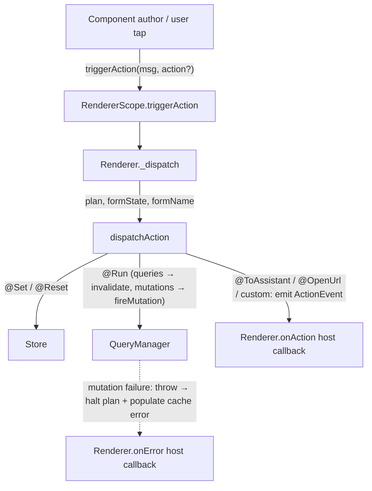

## Rework the action system to JS reference parity

## Overview

Replace the experimental v0.1 action surface in `openui_core`, `openui`, `openui_chat`, and the example app with a JS-reference-shaped contract. After this change:

- The host sees a single `Renderer.onAction(ActionEvent)` callback that fires once per host-routed step (`@ToAssistant`, `@OpenUrl`, and any custom-typed step).
- `ActionEvent` is `{ type, params, humanFriendlyMessage, formState, formName }` — the old `{ plan, statementId, payload }` is deleted. `formState` is a plain `Map<String, Object?>?` (unmodifiable view), no wrapper class.
- `@Set`, `@Reset`, and `@Run` are runtime-internal. The renderer mutates the store for the first two and routes the third to its `QueryManager`. None of them surface as `ActionEvent`s.
- Component authors call `RendererScope.triggerAction(userMessage, {formName, action})` — the single public seam on `RendererScope`. Used by both the implicit-Button path and the AST-action path (where the renderer-synthesized closure captures a `BuildContext` from the existing `ErrorBoundary.builder`).
- Buttons without an explicit `onClick` automatically `triggerAction(label)`, matching the JS "implicit `@ToAssistant`" behavior.
- `ActionEvent.type` is an open `String`. Built-in values come from `BuiltinActionType` (an `abstract final class` with `static const String continueConversation = 'continueConversation'` and `static const String openUrl = 'openUrl'`), so hosts write `event.type == BuiltinActionType.continueConversation` directly. Custom types are emitted by component code constructing a `CustomActionStep` and passing it to `triggerAction`.

This is a fully breaking rewrite of the action surface. Everything affected is currently `@experimental` with no production callers.

## Problem Statement

The Dart action surface diverges from the JS reference in five places:

1. **Host callback granularity.** `dispatchAction` exposes three host callbacks (`onRun`, `onContinueConversation`, `onOpenUrl`) and the `Renderer.onAction` fires once per whole plan with the full step list. JS exposes a single `onAction(event)` callback that fires once per host-routed step.
2. **`@Run` routing.** Today the renderer wires `onRun` into `QueryManager.invalidate`, but `dispatchAction` still takes `onRun` as a public hook. JS treats `@Run` as internal to the runtime — it never reaches the host.
3. **Event shape.** Today's `ActionEvent` is `{ plan, statementId, payload }`. JS's is `{ type, params, humanFriendlyMessage, formState, formName }`. Hosts cannot switch on `event.type` cleanly because there is no type field.
4. **Component-author API.** Components close over `_dispatch(value, statementId)` through `RendererScope.onActionAst`, which leaks parser types into the component package. JS exposes a `useTriggerAction(userMessage, {formName, action})` hook for component authors.
5. **Implicit Button behavior.** JS Buttons without an `onClick` prop automatically send their label to the assistant. The Dart Button just disables.
6. **Custom action types.** JS hosts can receive arbitrary `event.type` values (components opt in). Today's parser-defined step sealed class precludes that.

Additionally, `ActionEvent` is duplicated between `openui/lib/src/action_event.dart` and `openui_chat/lib/src/controller.dart` because `openui_chat` doesn't depend on the Flutter `openui` package and needs the type for `OpenUiChatController.handleAction`.

## Proposed Solution

### Package layout changes

| Type | Current home | New home | Reason |
|---|---|---|---|
| `ActionEvent` | `openui` + duplicate in `openui_chat` | `openui_core` | Framework-agnostic; consumed by both `openui` (renderer) and `openui_chat` (controller). Removes the duplicate. |
| `BuiltinActionType` | (new) | `openui_core` | `abstract final class` with `static const String` constants. Lives next to `ActionEvent`. |
| `ActionPlan`, `ActionStep` subclasses | `openui_core` | `openui_core` | Unchanged location. New `CustomActionStep` subclass added for component-emitted custom types. Built-in step subclasses gain no `type` field — the canonical string is set by the dispatcher when constructing the `ActionEvent`. |
| `dispatchAction` | `openui_core` | `openui_core` | Signature changes (see below). Becomes a runtime helper used by the renderer; no longer carries the public `onContinueConversation` / `onOpenUrl` callbacks. |
| `RendererScope.onActionAst` | `openui` | `openui` | Renamed `triggerAction` with a new signature. Sole public seam — no companion method. |

### New `ActionEvent` shape

```dart
@experimental
@immutable
class ActionEvent {
  const ActionEvent({
    required this.type,
    this.humanFriendlyMessage,
    this.params = const <String, Object?>{},
    this.formState,
    this.formName,
  });

  /// Open string. Built-in values live on [BuiltinActionType].
  /// Custom types come from component code.
  final String type;

  /// User-facing message. For `@ToAssistant`, the evaluated message.
  /// For implicit Button activation, the Button's `label`. For
  /// `@OpenUrl` and custom types, the component supplies whatever
  /// is meaningful (may be `null` or empty).
  final String? humanFriendlyMessage;

  /// Type-specific payload. For `@OpenUrl`: `{'url': String}`. For
  /// `@ToAssistant`: `{'context': String?}` when the second arg is
  /// present. For custom types: whatever the component passes.
  final Map<String, Object?> params;

  /// Form values at the moment the action fires, or `null` when not
  /// inside a Form. The map is unmodifiable.
  final Map<String, Object?>? formState;

  /// Form name, or `null` when not inside a Form.
  final String? formName;
}

@experimental
abstract final class BuiltinActionType {
  static const String continueConversation = 'continueConversation';
  static const String openUrl = 'openUrl';
}
```

Hosts compare `event.type` against the constants directly:

```dart
if (event.type == BuiltinActionType.continueConversation) { ... }
```

`BuiltinActionType` is `abstract final` with a private constructor so
it cannot be instantiated or extended — purely a namespace for the
canonical strings.

**`formState` is a plain `Map<String, Object?>?`** (not a wrapper
class). The dispatcher wraps the snapshot in `Map.unmodifiable(...)`
before constructing the `ActionEvent`, so the field is immutable in
practice. The brainstorm's open question on a typed `FormState` value
class is resolved in favor of the plain map for simplicity — `null`
when not inside a Form, an unmodifiable map otherwise.

### New `dispatchAction` signature

Hosts no longer call `dispatchAction` directly. The renderer drives it
through its own internal dispatcher that:

- Mutates the store for `@Set` / `@Reset`.
- Routes `@Run` to `QueryManager` (`invalidate` for queries,
  `fireMutation` for mutations).
- Emits an `ActionEvent` to `widget.onAction` for `@ToAssistant`,
  `@OpenUrl`, and any custom-typed step.

`dispatchAction` keeps its current location and structure for the
non-host paths but loses `onRun` / `onContinueConversation` /
`onOpenUrl`. Its new signature:

```dart
@experimental
Future<void> dispatchAction({
  required ActionPlan plan,
  required EvalContext context,
  required Future<void> Function(RunStep step) onRun,
  required void Function(ActionEvent event) onHostStep,
  Map<String, AstNode> stateDefaults = const <String, AstNode>{},
  Map<String, Object?>? formState,
  String? formName,
  String? humanFriendlyMessage,
});
```

Both callbacks are required because the only caller is the renderer.
`onRun` is the internal mutation/query runner (provided by the
renderer's `QueryManager` adapter); `onHostStep` is the renderer's
`onAction` wrapper.

**Rethrow contract**: `dispatchAction` catches throws from `onRun`
internally and returns normally — the plan halts but the caller does
not see the exception. The mutation's failure has already been written
to the `QueryManager`'s error entry and surfaced via the existing
`Renderer.onError` channel; rethrowing would force the renderer to
add a redundant try/catch and risk uncaught-future warnings. Other
step types do not throw.

**Built-in step types**: when constructing the `ActionEvent` for a
`ContinueConversationStep` or `OpenUrlStep`, the dispatcher hardcodes
`BuiltinActionType.continueConversation` / `BuiltinActionType.openUrl`
via a `switch`. Built-in step subclasses do not carry a `type` field
of their own.

### New `RendererScope.triggerAction`

```dart
@experimental
Future<void> triggerAction(
  String userMessage, {
  String? formName,
  ActionPlan? action,
});
```

Replaces `onActionAst`. Semantics:

- If `action == null`, the renderer short-circuits: it constructs an
  `ActionEvent(type: BuiltinActionType.continueConversation,
  humanFriendlyMessage: userMessage, formState: ..., formName: ...)`
  and calls `widget.onAction` directly. No AST synthesis, no plan, no
  dispatcher call. This is the implicit-Button path.
- If `action != null`, the renderer dispatches the supplied plan via
  `dispatchAction`. `userMessage` is passed as `humanFriendlyMessage`
  for any host-routed step (Button's `label` is the natural source).
- `formName` is propagated into every emitted `ActionEvent`'s
  `formName` field; `formState` is snapshotted from the renderer's
  `FormStateCache` at dispatch time.

The renderer continues to construct an `ActionPlan` from parsed
`onClick` ASTs in `_resolvePropValue` (so the parsing logic stays in
one place). The resolved prop value is the **`ActionPlan?`** itself —
the renderer does not synthesize a callback. Components that take
action props read `props['onClick'] as ActionPlan?` and call
`RendererScope.of(context).triggerAction(label, formName: ...,
action: plan)` from inside their own `Builder`. The Flutter
`BuildContext` stays in the component layer where it belongs; nothing
about it leaks into the prop bag or the renderer's resolution path.

**One public method on `RendererScope`**: `triggerAction`. There is no
`dispatchAstAction` companion — the AST path uses the same entry point.

### `ActionStep` shape changes

`ContinueConversationStep`, `OpenUrlStep`, `SetStep`, `ResetStep`, and
`RunStep` are **unchanged**. The canonical built-in `type` string lives
on `BuiltinActionType`; the dispatcher's switch sets it when
constructing the emitted `ActionEvent`.

A new `CustomActionStep` is added for component-emitted custom types:

```dart
@experimental
final class CustomActionStep extends ActionStep {
  const CustomActionStep({
    required this.type,
    this.params = const <String, Object?>{},
    this.humanFriendlyMessage,
  });
  final String type;
  final Map<String, Object?> params;
  final String? humanFriendlyMessage;

  @override
  bool operator ==(Object other) =>
      identical(this, other) ||
      other is CustomActionStep &&
          other.type == type &&
          other.humanFriendlyMessage == humanFriendlyMessage &&
          _mapEquals(other.params, params);

  @override
  int get hashCode => Object.hash(
        CustomActionStep,
        type,
        humanFriendlyMessage,
        Object.hashAllUnordered(params.entries.map((e) => Object.hash(e.key, e.value))),
      );
}
```

**`params` is `Map<String, Object?>`, not `Map<String, AstNode>`.**
`CustomActionStep` is constructed by component Dart code, not the
parser, so the component already has the final values. Skipping the
AST level removes a wrap-and-evaluate cycle and means the dispatcher
just passes `step.params` straight through to the emitted
`ActionEvent.params`. A component that genuinely needs to reference
`$state` from a custom step can read the store at the moment it
constructs the step.

**Equality for `params`**: insertion-order-independent map equality —
two `CustomActionStep`s with the same keys mapped to equal values are
equal regardless of iteration order. A new private `_mapEquals` helper
in `actions.dart` does the comparison; `hashCode` uses
`Object.hashAllUnordered` over key/value hash pairs.

`CustomActionStep` is **not** produced by `actionPlanFromAst` — the
parser stays closed to the five JS-defined builtins. Component code
constructs `CustomActionStep` directly and passes it to
`triggerAction(..., action: ActionPlan(steps: [step]))`.

### Implicit Button `@ToAssistant(label)`

`ButtonWidget.onPressed` is no longer derived solely from the
`onClick` prop's action callback. New flow in
`buttonComponent.render`:

```dart
render: (ctx, props, renderNode, id) {
  final label = props['label']?.toString() ?? '';
  final onClick = props['onClick'] as VoidCallback?;
  return Builder(
    builder: (context) {
      final scope = RendererScope.maybeFind(context);
      final form = FormScope.maybeFind(context)?.name;
      VoidCallback? onPressed;
      if (onClick != null) {
        onPressed = onClick;
      } else if (scope != null) {
        onPressed = () => scope.triggerAction(label, formName: form);
      }
      return ButtonWidget(
        label: label,
        variant: props['variant'] as String? ?? 'primary',
        onPressed: onPressed,
      );
    },
  );
}
```

Per Open Question resolution: implicit `@ToAssistant` is Button-only in
v1.

### Mutation failure surfacing

Resolved: silent halt + existing `OpenUIError` channel.

`QueryManager` gains `fireMutation(statementId, args)` which:
- Looks up the mutation, fires it via `toolProvider` / `loader`.
- On success, returns the value (the renderer ignores it but the
  contract preserves parity).
- On failure, populates the cache entry's `error` field with an
  `OpenUIError` (the existing `_handleQueryChange` → `onError` path
  already surfaces it) and throws so the dispatcher halts the plan.

No synthetic `ActionEvent` is emitted for failure. Hosts subscribe to
`Renderer.onError` (as today).

### Cross-package consumer audit

| File | Change |
|---|---|
| `packages/openui_core/lib/src/actions/actions.dart` | Add `ActionEvent` and `BuiltinActionType`. Add `CustomActionStep` (with manual `==`/`hashCode` matching the existing step subclasses). Reshape `dispatchAction` (`onHostStep` + internal `onRun`; drops `onContinueConversation` / `onOpenUrl` / the public `onRun`). Built-in step subclasses unchanged. |
| `packages/openui_core/lib/openui_core.dart` | Add `ActionEvent`, `BuiltinActionType`, `CustomActionStep` to exports. |
| `packages/openui/lib/src/action_event.dart` | Delete. Consumers import `ActionEvent` from `openui_core`. |
| `packages/openui/lib/openui.dart` | Remove the local `ActionEvent` export. No re-export — consumers update their imports to `package:openui_core/openui_core.dart` (everything is `@experimental` and pre-1.0, so the one-line migration is cheaper than carrying a barrel forever). |
| `packages/openui/lib/src/renderer_scope.dart` | Rename `onActionAst` → `triggerAction` (signature: `Future<void> Function(String userMessage, {String? formName, ActionPlan? action})`). Single public seam. |
| `packages/openui/lib/src/renderer.dart` | Replace `_dispatch` (line 235) with `_triggerAction`. Wire `_queryManager.fireMutation` for mutations and `_queryManager.invalidate` for queries via the new `dispatchAction`'s `onRun`. `_resolvePropValue` (line 482) returns an `ActionPlan?` (instead of a `VoidCallback`) when the AST is action-shaped. The Button component wires the actual `triggerAction` call from inside its own `Builder`. |
| `packages/openui/lib/src/query_manager.dart` | Add `Future<Object?> fireMutation(String statementId, List<Argument> args)`. On failure: populate `QueryEntry.error`, notify `onChange`, rethrow. `dispatchAction` catches the throw internally to halt the plan. |
| `packages/openui_components/lib/src/components/button.dart` | Wrap `ButtonWidget` in a `Builder` so the registration has a `BuildContext`. Read `props['onClick']` as `ActionPlan?`. When non-null: `onPressed: () => RendererScope.of(ctx).triggerAction(label, formName: FormScope.maybeFind(ctx)?.name, action: plan)`. When null: `onPressed: () => RendererScope.of(ctx).triggerAction(label, formName: FormScope.maybeFind(ctx)?.name)`. Update `description:` (see Button description section). |
| `packages/openui_chat/lib/src/controller.dart` | Delete the local `ActionEvent` class (lines 234–256). Import from `package:openui_core/openui_core.dart`. Rewrite `handleAction` (line 137) to switch on `event.type == BuiltinActionType.continueConversation`. |
| `packages/openui_chat/lib/openui_chat.dart` | Remove `ActionEvent` from the `controller.dart` export list. Do **not** re-export from `openui_core`. Consumers update their imports. |
| `apps/openui_flutter_example/lib/src/scripts_chat/chat_screen.dart` | The file already imports `package:openui_core/openui_core.dart` (line 9). The `onAction` `debugPrint` callback (line 141) compiles unchanged once `ActionEvent` resolves through that import instead of `package:openui/openui.dart`. |
| `apps/openui_flutter_example/lib/src/llm_chat/llm_chat_screen.dart` | Update the `openuiLibrary().prompt(...)` call (line 33) to include a `PromptOptions.examples` entry showing a Button without `onClick`. |
| `packages/openui_core/test/src/actions/actions_test.dart` | Rewrite `dispatchAction` tests to the new `{onRun, onHostStep, formState, formName, humanFriendlyMessage}` signature. Add `CustomActionStep` equality / hashCode tests. |
| `packages/openui/test/src/renderer_test.dart` | Rewrite three action-related tests for the new `ActionEvent` shape (lines 253-303, 480-527). Add tests for: `@Set` / `@Reset` / `@Run` emit zero `ActionEvent`s; `@Run` on a mutation that throws halts the plan; `formName` and `formState` populated for AST actions inside a Form; `onError` fires exactly once per mutation failure (no duplicate from cache notify + dispatch halt). |
| `packages/openui/test/src/renderer_scope_test.dart` | Replace `onActionAst:` stub (lines 22, 130) with `triggerAction:` stub. |
| `packages/openui_components/test/src/components_render_test.dart` | Rewrite Button test (lines 65-86): `onClick: @Set($count, $count + 1)` now produces zero `ActionEvent`s. Add implicit-Button test. Add Form + Button `formName` / `formState` test. |
| `packages/openui_chat/test/src/controller_test.dart` | Rewrite the two `handleAction` tests (lines 156-210) against the new `ActionEvent` shape. Add a `humanFriendlyMessage == null` test for `continueConversation` (no `sendMessage` fires). |
| `docs/lang-reference.md` | Audit for references to the old `ActionEvent` shape. Update any code samples or callback descriptions to the new contract. |

## Architecture flow



## Implementation Tasks

### `openui_core` — types

- [ ] In `packages/openui_core/lib/src/actions/actions.dart`:
  - Add `ActionEvent` (shape: `type`, `humanFriendlyMessage`, `params`, `formState: Map<String, Object?>?`, `formName`)
  - Add `abstract final class BuiltinActionType` with `static const String continueConversation = 'continueConversation'` and `static const String openUrl = 'openUrl'`. No private constructor — `abstract final` already blocks instantiation.
  - Add `CustomActionStep` with `params: Map<String, Object?>` (component-supplied plain values, not ASTs). Manual `==` and `hashCode` following the existing step pattern; `params` uses unordered map equality via a private `_mapEquals` helper.
  - **Do not** modify `ContinueConversationStep`, `OpenUrlStep`, `SetStep`, `ResetStep`, `RunStep` — built-in step subclasses are unchanged
- [ ] Replace `dispatchAction` signature with `{required plan, required context, required onRun, required onHostStep, stateDefaults, formState, formName, humanFriendlyMessage}` and update the dispatch loop:
  - `SetStep` / `ResetStep`: as today. Eval failures land in `ctx.errors` (current behavior); plan continues.
  - `RunStep`: call `await onRun(step)`. Wrap in try/catch — on throw, halt the rest of the plan but do not propagate to the caller (return normally).
  - `ContinueConversationStep`: evaluate `messageAst` (and `contextAst` if present). If `messageAst` evaluates to a non-`String`, **skip emission** for this step and continue the plan (matches today's behavior in `actions.dart:282-291`). When emitting, prefer the evaluated message over the passed-in `humanFriendlyMessage`. `params['context']` populated only when `contextAst` evaluates to a `String`.
  - `OpenUrlStep`: evaluate `urlAst`. If non-`String`, skip emission and continue (matches `actions.dart:293-297`). Emit with `params: {'url': <evaluated>}`, `humanFriendlyMessage: passed-in` (may be `null`).
  - `CustomActionStep`: emit `ActionEvent(type: step.type, humanFriendlyMessage: step.humanFriendlyMessage, params: step.params, formState: ..., formName: ...)`. No evaluation step — `params` is already plain Dart values.
  - `formState` arrives at `dispatchAction` already unmodifiable (the renderer wraps it once at snapshot time). The dispatcher passes it through verbatim — no re-wrapping.
  - **`dispatchAction` never throws to callers**: `onRun` failures are caught, eval failures for host steps cause skip-emission, and other step types don't throw. The function always returns normally.
- [ ] Add exports to `packages/openui_core/lib/openui_core.dart`:
  - `ActionEvent`
  - `BuiltinActionType`
  - `CustomActionStep`

### `openui` — Flutter renderer

- [ ] Delete `packages/openui/lib/src/action_event.dart`
- [ ] Remove the `ActionEvent` export from `packages/openui/lib/openui.dart` (line 8). No re-export from `openui_core`.
- [ ] In `packages/openui/lib/src/renderer_scope.dart`:
  - Rename the field `onActionAst` (line 43) to `triggerAction`
  - New type: `Future<void> Function(String userMessage, {String? formName, ActionPlan? action})`
  - Update the `RendererScope` constructor parameter and `updateShouldNotify` accordingly
- [ ] In `packages/openui/lib/src/renderer.dart`:
  - Replace `_dispatch` (line 235) with `_triggerAction(String userMessage, {String? formName, ActionPlan? action})`
  - Snapshot `formState` via `_formStateCache.snapshot(formName)` (returns `null` when `formName == null`; otherwise an unmodifiable map). Wrap once at snapshot — `dispatchAction` does not re-wrap.
  - When `action == null`: short-circuit. Call `widget.onAction?.call(ActionEvent(type: BuiltinActionType.continueConversation, humanFriendlyMessage: userMessage, formState: snapshot, formName: formName))`. No `dispatchAction` call.
  - When `action != null`: call `dispatchAction(plan: action, context: _buildEvalContext(result), stateDefaults: ..., onRun: _onRun, onHostStep: (event) => widget.onAction?.call(event), formState: snapshot, formName: formName, humanFriendlyMessage: userMessage)`
  - Implement `_onRun(RunStep step)`: looks up args via `_argsForRunnable(result, step.statementId)` (line 376); if `_argsForRunnable` returns `null` (statement not found), throw — the dispatcher catches it and halts the plan (matches mutation-failure semantics). If the statement is a query → `manager.invalidate(id, args)`; if a mutation → `await manager.fireMutation(id, args)` (throw propagates into `dispatchAction`'s try/catch).
  - In `_resolveProps` (line 454), pre-extract the evaluated `label` value (when present) once per `CompCall`. (Not strictly required for the Button — Button can read `props['label']` itself — but useful for any future component that wants a `label`-driven implicit trigger.)
  - In `_resolvePropValue` (line 482), when an action plan is detected from the AST: return the `ActionPlan` value directly. **No callback synthesis.** The renderer is no longer in the business of constructing component-side closures.
  - Update the `RendererScope` construction in `build()` (line 312) to pass `triggerAction: _triggerAction`
- [ ] In `packages/openui/lib/src/query_manager.dart`:
  - Add `Future<Object?> fireMutation(String statementId, List<Argument> args)` next to `invalidate` (line 120)
  - On success: return the resolved value. Do **not** write to `_entries` — the query cache is for query results only; mutations don't have cached values.
  - On failure: write `QueryEntry(error: ...)` into `_entries[statementId]`, call `onChange?.call()`, and rethrow so the dispatcher can halt
- [ ] Extend `packages/openui/lib/src/form_state_cache.dart`:
  - Add `Map<String, Object?>? snapshot(String? formName)` — returns `null` when `formName == null`; otherwise iterates `_controllers` keys where `_Key.form == formName`, returns `Map.unmodifiable({fieldName: controller.text})` for each match (empty map when the form exists but has no fields)

### Action prop shape

Action props resolve to `ActionPlan?` in the prop bag. Components that
accept action props (Button today, Form `onSubmit` follow-up) read
`props['onClick'] as ActionPlan?` from inside their own `Builder` and
call `RendererScope.of(context).triggerAction(label, formName: ...,
action: plan)`. This keeps `BuildContext` out of the prop bag and out
of the renderer's prop-resolution path; the widget layer handles its
own context lookups.

### `openui_components` — Button

- [ ] In `packages/openui_components/lib/src/components/button.dart`:
  - `buttonComponent.render` (line 59) wraps `ButtonWidget` in a `Builder` so the registration has a `BuildContext`
  - Read `final action = props['onClick'] as ActionPlan?;` (the renderer resolves action-shaped ASTs to `ActionPlan?` values)
  - Resolve `final scope = RendererScope.maybeFind(buttonContext);` and `final formName = FormScope.maybeFind(buttonContext)?.name;`
  - Build `onPressed`:
    ```dart
    onPressed: scope == null
        ? null
        : () => scope.triggerAction(label, formName: formName, action: action);
    ```
    When `action == null`, this is the implicit-`@ToAssistant(label)` path; when non-null, it dispatches the AST-derived plan.
- [ ] No changes to `ButtonWidget` itself; the wiring lives in the component registration

### `openui_components` — Form (optional: leave for follow-up)

The brainstorm does not require Form `onSubmit` parity in this plan.
Form currently has no `onSubmit` prop. **Out of scope here.** A follow-up
plan can add `onSubmit` and exercise the `formState` / `formName`
fields end-to-end. The fields are wired through and tested via the
implicit-Button path (Button inside a Form fires with `formState`
populated).

### `openui_components` — Button description (LLM-facing)

The implicit `@ToAssistant(label)` behavior changes how the LLM should
emit Button code. The component `description` flows into the generated
system prompt via `generatePrompt`, so the model needs the updated
copy.

- [ ] In `packages/openui_components/lib/src/components/button.dart`, update `buttonComponent()`'s `description:` to: `'tappable button; omit onClick to send the label to the assistant'` (or equivalent — confirm phrasing reads cleanly in the generated signature line)
- [ ] No grammar primer changes. The lang surface (`@Set`/`@Reset`/`@Run`/`@ToAssistant`/`@OpenUrl`) is unchanged, so `_kGrammarPrimer` in `packages/openui_core/lib/src/prompt/prompt.dart` stays put

### Example app — prompt rules

The example app constructs its `PromptOptions` inline (`apps/openui_flutter_example/lib/src/llm_chat/llm_chat_screen.dart:33`). The default `PromptOptions()` produces a generic RULES section; teaching the model the implicit-Button idiom is best done with an explicit example.

- [ ] In `apps/openui_flutter_example/lib/src/llm_chat/llm_chat_screen.dart`, update the `openuiLibrary().prompt(...)` call site to pass `PromptOptions(examples: [<implicit Button example>])` showing a Button without `onClick`. Suggested example string:
  ```
  // Send the user's choice back to the assistant when tapped.
  root = Buttons(children: [Button(label: "Yes"), Button(label: "No")])
  ```
- [ ] If the existing `PromptOptions()` already passes `examples`, append to them rather than replacing

### `openui_chat` — controller

- [ ] In `packages/openui_chat/lib/src/controller.dart`:
  - Delete the local `ActionEvent` class (lines 234–256)
  - The file already imports `package:openui_core/openui_core.dart` (line 10) — no new import needed
  - Rewrite `handleAction(ActionEvent event)` (line 137):
    ```dart
    Future<void> handleAction(ActionEvent event) async {
      if (event.type != BuiltinActionType.continueConversation) return;
      final msg = event.humanFriendlyMessage;
      if (msg != null && msg.isNotEmpty) await sendMessage(msg);
    }
    ```
- [ ] In `packages/openui_chat/lib/openui_chat.dart`:
  - Remove `ActionEvent` from the `src/controller.dart` export `show` list (line 23)
  - Do **not** add a re-export from `openui_core`. The duplicate type was an accident of `openui_chat` not depending on `openui`; the canonical home is `openui_core`, and consumers import it directly. One symbol, one source.

### Tests

#### `openui_core`

- [ ] Rewrite `packages/openui_core/test/src/actions/actions_test.dart`:
  - Drop the `onContinueConversation` / `onOpenUrl` / public `onRun` callback-shape tests
  - Add `dispatchAction` tests against the new signature:
    - `@Set` writes the store (unchanged behavior)
    - `@Reset` writes defaults (unchanged behavior)
    - `@Run` calls `onRun(step)` once with the step
    - `@Run` whose `onRun` throws halts subsequent steps **and** `dispatchAction` returns normally (does not rethrow)
    - `@ToAssistant` calls `onHostStep` exactly once with `event.type == BuiltinActionType.continueConversation`, `humanFriendlyMessage` equal to evaluated message, `params['context']` from second arg when present
    - `@OpenUrl` calls `onHostStep` once with `event.type == BuiltinActionType.openUrl`, `params['url']` equal to evaluated URL
    - `CustomActionStep` calls `onHostStep` once with `event.type == step.type`, `params` populated from the step's evaluated `params` map, `humanFriendlyMessage == step.humanFriendlyMessage`
    - `formState` / `formName` / `humanFriendlyMessage` passed to `dispatchAction` propagate to every emitted `ActionEvent`
    - `formState` arrives at `onHostStep` wrapped in `Map.unmodifiable` — mutation attempts throw
  - Keep all `ActionStep` equality and `actionPlanFromAst` tests unchanged for built-in steps
  - Add `CustomActionStep` equality / hashCode tests:
    - Identical type + params + humanFriendlyMessage are equal; hashCodes match
    - Differing `type` ⇒ not equal
    - Differing `humanFriendlyMessage` ⇒ not equal
    - `humanFriendlyMessage: null` vs `humanFriendlyMessage: ''` ⇒ not equal (empty-vs-null distinction matters because `openui_chat` treats both as no-op but the equality contract should still discriminate)
    - Same keys/values in `params` but different insertion order ⇒ still equal (unordered map equality)
    - Different keys in `params` ⇒ not equal

#### `openui`

- [ ] Update `packages/openui/test/src/renderer_test.dart`:
  - "action prop dispatches Set step against the store" (line 253) — assert **zero** `ActionEvent`s emitted (only the store change)
  - "action prop remains interactive after stream finalizes without newline" (line 278) — assert zero events
  - "Reset step writes the declared default back to the store" (line 305) — assert zero events
  - "Run step invalidates and re-fires the named query" (line 335) — assert zero events
  - "`@ToAssistant` emits an `ActionEvent` with `ContinueConversationStep`" (line 480) — rewrite to assert `event.type == BuiltinActionType.continueConversation`, `event.humanFriendlyMessage == 'retry'`
  - "`@OpenUrl` emits an `ActionEvent` with `OpenUrlStep`" (line 505) — rewrite to assert `event.type == BuiltinActionType.openUrl`, `event.params['url'] == 'https://example.com'`
  - Add new test: "`@Run` on a mutation fires the mutation and halts on failure" — drive via a `queryLoader` that throws for the mutation statement; assert subsequent `@Set` in the same plan didn't write
  - Add new test: "`@Run` on a failing mutation fires `onError` exactly once" — wire a counting `onError` callback; assert it fires once and that the cache notify + dispatch halt do not double-report
  - Add new test: "AST action inside a Form carries `formName` and `formState`" — render `Form(name: "f", children: [Input(name: "x", value: $x), Button(label: "Go", onClick: @ToAssistant("submit"))])`, enter text, tap, assert `event.formName == 'f'` and `event.formState!['x'] == 'typed'`
  - Add new test: "Implicit Button inside a Form carries `formName` and `formState`" — same fixture without `onClick`; assert `event.type == BuiltinActionType.continueConversation`, `event.humanFriendlyMessage == 'Go'`, `event.formName == 'f'`, `event.formState!['x'] == 'typed'`
- [ ] Update `packages/openui/test/src/renderer_scope_test.dart`:
  - Replace `onActionAst: (_, _, {payload}) async {}` (lines 22, 130) with `triggerAction: (_, {formName, action}) async {}`
  - Add test: `RendererScope.of(context).triggerAction('hi')` runs without error when no action is supplied (short-circuits to implicit ActionEvent)
  - Add test: `triggerAction('')` with empty string still emits an `ActionEvent` (the renderer is unopinionated about empty messages; the chat controller's own filter rejects them)
- [ ] Update `packages/openui/test/src/query_manager_test.dart`:
  - Add test: `fireMutation` returns the resolved value on success and does not write to the cache
  - Add test: `fireMutation` populates the entry's error and rethrows on failure
  - Add test: `fireMutation` rethrowing surfaces an `OpenUIError` through the existing `errors()` getter
- [ ] Update `packages/openui/test/src/form_state_cache_test.dart`:
  - Add test: `snapshot(null)` returns `null`
  - Add test: `snapshot('missing')` returns an empty unmodifiable map (form name has no fields)
  - Add test: `snapshot('f')` after `controllerFor(formName: 'f', fieldName: 'a', initialValue: 'x')` returns `{'a': 'x'}`
  - Add test: `snapshot('f')` reflects post-edit controller text (drive via `controller.text = 'y'`)
  - Add test: two forms with the same field name return their own values — `snapshot('a')` does not bleed into `snapshot('b')`
  - Add test: returned map is unmodifiable (mutation attempts throw)

#### `openui_components`

- [ ] Update `packages/openui_components/test/src/components_render_test.dart`:
  - "Button fires its onClick action plan" (line 65) — rewrite to assert zero events for the `@Set` path (local store mutation; no host signal)
  - Add new test: "Button without onClick fires implicit @ToAssistant with its label" — render `Button(label: "Retry")` with no `onClick`, tap, assert one event with `event.type == BuiltinActionType.continueConversation`, `event.humanFriendlyMessage == 'Retry'`
  - Add new test: "Button inside a Form populates formName and formState" — render `Form(name: "f", children: [Input(name: "x", value: $x), Button(label: "Send")])` with no `onClick`, enter text, tap, assert `event.formName == 'f'` and `event.formState!['x'] == 'typed'`

#### `openui_chat`

- [ ] Update `packages/openui_chat/test/src/controller_test.dart`:
  - Rewrite "handleAction forwards ContinueConversationStep through sendMessage" (line 156) — pass `ActionEvent(type: BuiltinActionType.continueConversation, humanFriendlyMessage: 'hi')` and assert `sendMessage('hi')` fires
  - Rewrite "handleAction ignores non-ContinueConversation steps" (line 192) — pass `ActionEvent(type: BuiltinActionType.openUrl, params: {'url': 'https://x'})` and assert no request
  - Add: "handleAction skips `continueConversation` events with null or empty `humanFriendlyMessage`" — assert no `sendMessage` fires

## Acceptance Criteria

- [ ] `ActionEvent` lives in `openui_core` with shape `{type, humanFriendlyMessage, params, formState, formName}`; the previous `{plan, statementId, payload}` shape is gone from every package
- [ ] `BuiltinActionType` is an `abstract final class` in `openui_core` with `static const String continueConversation` and `static const String openUrl`; hosts compare via `event.type == BuiltinActionType.continueConversation`
- [ ] `formState` is exposed as `Map<String, Object?>?` (no wrapper class); the map is unmodifiable when non-null
- [ ] The duplicate `ActionEvent` class in `openui_chat/lib/src/controller.dart` is deleted; `openui_chat` does not re-export the type
- [ ] `dispatchAction` no longer accepts `onContinueConversation` or `onOpenUrl`; the host-routed callback is the unified `onHostStep`. `onRun` is required and internal-only (the renderer drives it through `QueryManager`)
- [ ] `dispatchAction` never throws to callers under any input — `onRun` failures, eval failures, and missing-statement lookups are all caught internally and skip-or-halt without propagating
- [ ] Eval failures on `@ToAssistant` message/context and `@OpenUrl` URL evaluate-to-non-`String` cause skip-emission for that step; the plan continues with subsequent steps (matches current behavior)
- [ ] `formState` is wrapped with `Map.unmodifiable` exactly once — at snapshot time in `FormStateCache.snapshot`. The dispatcher passes it through verbatim.
- [ ] Action props resolve to `ActionPlan?` values in the prop bag. The renderer does not synthesize callbacks; components handle their own widget-tree lookups.
- [ ] `Renderer.onAction` fires exactly once per host-routed step (`@ToAssistant`, `@OpenUrl`, `CustomActionStep`), and never for `@Set` / `@Reset` / `@Run`
- [ ] `@Run` on a mutation fires `QueryManager.fireMutation`; a thrown failure halts the rest of the plan, populates `QueryEntry.error`, and surfaces via `Renderer.onError` exactly once
- [ ] `@Run` on a query continues to fire `QueryManager.invalidate`
- [ ] `RendererScope` exposes `triggerAction(userMessage, {formName, action})` as the **sole** public seam; `onActionAst` is removed and no companion method is added
- [ ] Built-in `ContinueConversationStep` and `OpenUrlStep` carry no `type` field; the canonical strings are set by `dispatchAction`'s switch
- [ ] Buttons rendered without an `onClick` prop call `triggerAction(label)`, producing an `ActionEvent` with `event.type == BuiltinActionType.continueConversation` and `event.humanFriendlyMessage == label`. The implicit path short-circuits the dispatcher — no `Literal` AST is synthesized
- [ ] Buttons inside a `Form` (both AST `onClick` and implicit) populate `event.formName` and `event.formState` with the live form values
- [ ] `event.type` is typed as `String`; constructing an `ActionEvent` with a custom type string works without parser changes
- [ ] Custom action types reach the host via a component constructing an `ActionPlan` with a `CustomActionStep` and passing it to `triggerAction(..., action: plan)`
- [ ] `CustomActionStep` has structural `==` / `hashCode` over `type`, `humanFriendlyMessage`, and `params` (unordered map equality)
- [ ] `OpenUiChatController.handleAction` keys off `event.type == BuiltinActionType.continueConversation`; other event types and null/empty `humanFriendlyMessage` are no-ops
- [ ] All existing `openui_core`, `openui`, `openui_components`, `openui_chat` tests pass against the rewritten action contract; new tests cover the implicit Button, mutation failure (with single-fire `onError`), `formState` snapshot, AST-action-inside-Form, and `CustomActionStep` equality paths
- [ ] The example app's `chat_screen.dart` `onAction` `debugPrint` call still compiles; the printed shape is the new `ActionEvent`
- [ ] Button's generated signature line in `openuiLibrary().prompt(...)` output reflects the implicit-`@ToAssistant` behavior via the updated `description`
- [ ] The example app's `PromptOptions.examples` includes at least one Button without `onClick` so the LLM learns the idiom
- [ ] `docs/lang-reference.md` references to the old `ActionEvent` shape are updated

## Migration notes

The package is pre-1.0 and every action-related symbol is
`@experimental`, so semver doesn't force a major bump. The PR description
should carry a short migration cheat-sheet for any out-of-tree caller:

```
ActionEvent.plan → gone. Use event.type + event.params instead.
ActionEvent.statementId → gone.
ActionEvent.payload → gone. Use event.formState.

Renderer.onAction: signature unchanged (still ActionEvent), shape new.

dispatchAction({onRun, onContinueConversation, onOpenUrl, ...})
  → renderer-internal. Hosts subscribe to Renderer.onAction.

RendererScope.onActionAst → RendererScope.triggerAction.

Import ActionEvent from package:openui_core/openui_core.dart
(was: package:openui/openui.dart or package:openui_chat/openui_chat.dart).
```

A one-paragraph note in the PR body is sufficient — no `MIGRATION.md`
file. The example app's existing `debugPrint(event)` line is the only
in-tree caller and compiles against the new shape unchanged.

## Known Gaps (not in scope)

- **`Form.onSubmit` prop.** The JS reference accepts `onSubmit` on `Form`. This plan wires `formName` / `formState` through the implicit-Button path only. Adding `Form(onSubmit: @ToAssistant(...))` is a follow-up.
- **`useTriggerAction`-style component helpers.** JS exposes a hook with optional `userMessage`-only invocation; Dart can mirror with a method-level alias on `RendererScope`. The current `triggerAction` already covers the same shapes; a thinner sugar layer is future work.
- **Custom-type parser keywords.** The parser remains closed to `@Set`/`@Reset`/`@Run`/`@ToAssistant`/`@OpenUrl`. Custom types must be constructed by component Dart code. Lifting custom types into the lang (a la `@MyCustom(...)`) is out of scope.
- **Mutation-failure synthetic event.** Resolved as "no": failures surface via `Renderer.onError`. Adding a `mutation_failed` synthetic event type is a follow-up if the host needs richer signal.
- **`label`-source generalization.** Implicit `@ToAssistant` is Button-only. Components like `Callout` or `Card` that might want implicit actions are not addressed here.
