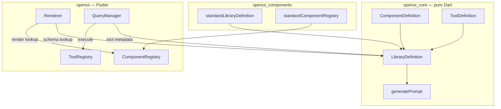
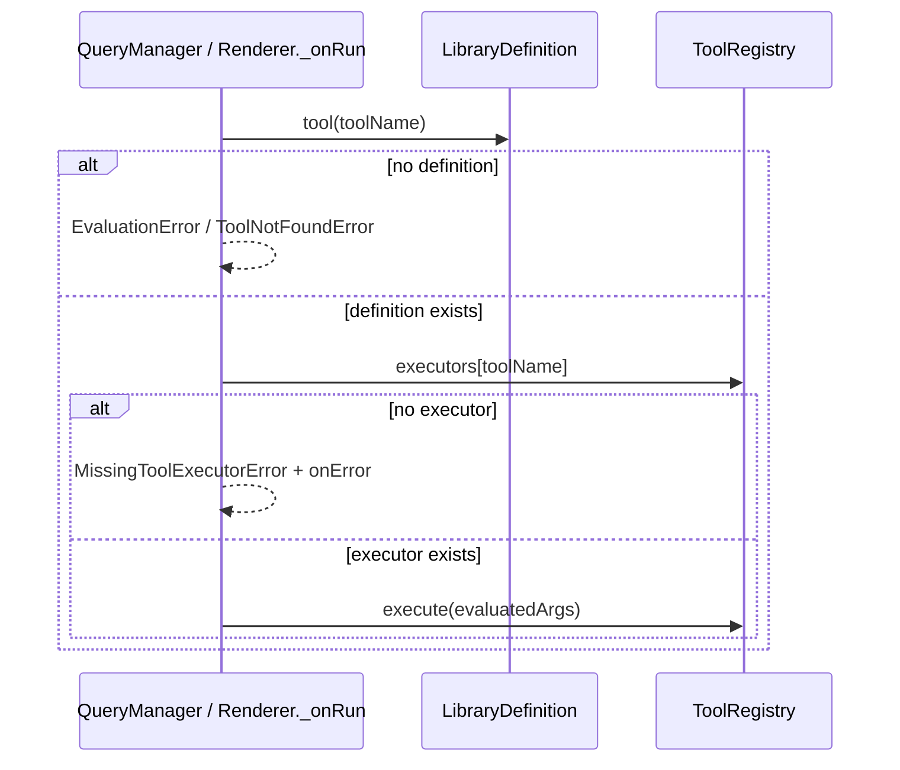
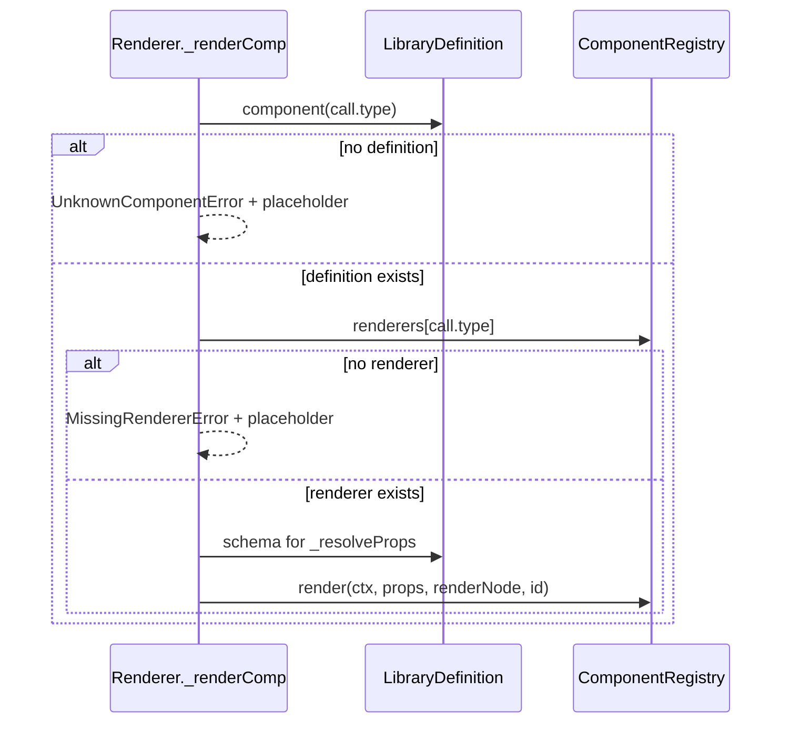

## refactor: separate library definitions from render/execute behavior - Extensive

## Overview

Split OpenUI's component and tool **definitions** (name, description, schemas, `internal` flag) from their **behavior** (Flutter render callbacks and tool executors). Replace the monolithic generic `Library<Widget>` / `Component<W>` / `Tool` model with:

1. **`openui_core`** — pure-Dart, `dart_mappable` definition models: `ComponentDefinition`, `ToolDefinition`, `LibraryDefinition`
2. **`openui`** — `ComponentRegistry`, `ToolRegistry`, and `Renderer` wired via dual lookup (definitions for schemas, registries for behavior)
3. **`openui_components`** — `standardLibraryDefinition()` + `standardComponentRegistry()`
4. **`openui_mcp`** — adapter producing `(ToolDefinition, ToolExecutor)` pairs

This is a **clean break** (pre-1.0): remove all generics and the `Tool` abstract class. Libraries remain **code-first**; JSON runtime loading is out of scope but enabled by serializable models.

### Delivery strategy: single PR

Ship as **one atomic PR** on `refactor/separate-library-definitions-from-renderers`. Phases below are an **implementation order** within that PR, not separate merge units. The monorepo may not build until all phases are complete — that is acceptable for a solo refactor.

Before opening the PR, run the full monorepo test suite and grep for stale types (`Library<Widget>`, `Component<Widget>`, `implements Tool`).

### Technical review gaps addressed

The following items from `/plan-technical-review` are explicitly covered below:

| Gap | Resolution in this plan |
|---|---|
| `check_deps.dart` missing `dart_mappable` | Phase 1 task + acceptance criterion |
| Asymmetric tool executor errors | `MissingToolExecutorError` + tests on all 4 tool dispatch paths |
| `openui_core` 100% coverage silent | Required quality gate; list files that must stay covered |
| Public `validateAgainst` / `ValidationReport` | Replaced with test-only `assertLibraryWiring` |
| `mergeOpenUIToolsInto` helper | Removed — manual wiring only |
| Prompt snapshot optional | Required; capture baseline **before** Phase 1 edits |
| `@experimental` on new types | Required on all new public symbols in core + openui barrels |
| Direct `@Run(toolName)` untested | Explicit renderer test in Phase 2 |
| Vertical slice before 17-file split | Phase 2.5 tracer bullet with `Button` only |
| `build_runner` workflow undocumented | Commit generated mappers; document codegen command |
| Architecture diagram stale | Phase 5 lists exact diagram replacements |
| `openui_mcp` README stale | Phase 5 doc pass |
| Core `Component<String>` tests removed | Phase 1 notes coverage migration to openui |
| Example chat golden | Phase 4 verifies integration test still passes |

## Problem Statement / Motivation

Today `Component<W>` bundles schema metadata with a render callback in one generic type (`packages/openui_core/lib/src/library/library.dart:45-74`). Apps pass a single `Library<Widget>` to `Renderer`, `QueryManager`, and prompt generation. This coupling:

- Prevents sharing definitions independently of Flutter rendering (server-side prompts, future JSON libraries)
- Forces generic `W` in core purely for testability (`Component<String>` in `library_test.dart`)
- Makes custom libraries conflate "what the LLM knows" with "how the app renders"

The renderer already hardcodes `Widget` (`packages/openui/lib/src/renderer.dart:18`, `:53`). The refactor makes that explicit and moves behavior maps to `openui`.

## Proposed Solution

### Architecture



### Dual lookup contract

| Dispatch step | Lookup source | Purpose |
|---|---|---|
| `CompCall` render | `library.component(name)` | Schema for `_resolveProps` / `evaluateElementProps` |
| `CompCall` render | `componentRegistry[name]` | `ComponentRender` callback |
| `@Query` / `@Run` / mutation | `library.tool(name)` | Validate tool exists; prompt metadata |
| `@Query` / `@Run` / mutation | `toolRegistry[name]` | `ToolExecutor` invocation |
| `generatePrompt` / `LibraryDefinition.prompt()` | `LibraryDefinition` only | No registries needed |

### Resolved open questions (from brainstorm)

| Question | Decision |
|---|---|
| Registry `.extend()` | **No** in v1 — manual map spread for registries; `LibraryDefinition.extend()` handles definition merging |
| MCP adapter shape | `McpClient.asOpenUIToolPairs()` → `List<OpenUIToolPair>` where `OpenUIToolPair = ({ToolDefinition definition, ToolExecutor execute})`; apps wire pairs manually (no merge helper) |
| Missing renderer when definition exists | New `MissingRendererError` (distinct from `UnknownComponentError`); same placeholder + `onError` path as unknown components |
| Missing executor when tool definition exists | New `MissingToolExecutorError` (symmetric with `MissingRendererError`); same error + `onError` path for `@Query`, `@Run`, and mutations |
| Tabs AST re-read | Render-side only in `renderTabs`; no statement access in definition factories |
| Registry-only entries | Allowed and inert unless referenced in source |

## Technical Approach

### New public types

#### `openui_core`

```dart
// packages/openui_core/lib/src/library/definitions.dart
@MappableClass()
class ComponentDefinition with ComponentDefinitionMappable { /* name, schema, description, internal */ }

@MappableClass()
class ToolDefinition with ToolDefinitionMappable { /* name, description, input?, output? */ }

@MappableClass()
class LibraryDefinition with LibraryDefinitionMappable {
  /* components, tools, libraryPrompt? */
  LibraryDefinition extend({List<ComponentDefinition> components = const [], List<ToolDefinition> tools = const []});
  String prompt({String? preamble, List<String> examples = const [], List<String> additionalRules = const []});
}

// packages/openui_core/lib/src/library/schema_mapper.dart
// @MappableField hooks: Schema ↔ Map<String, dynamic> via Schema.fromMap / schema.value
```

**Remove from core exports:** `Component`, `Library`, `ComponentRender`, `Tool`

**Keep in core:** `ToolResult`, `evaluateElementProps`, `ReactiveAssign`, `isReactiveAssign`, `generatePrompt(LibraryDefinition, ...)`

#### `openui`

```dart
// packages/openui/lib/src/component_registry.dart
typedef ComponentRender = Widget Function(
  EvalContext context,
  Map<String, Object?> props,
  Widget Function(AstNode node, EvalContext context) renderNode,
  String statementId,
);

class ComponentRegistry {
  ComponentRegistry({required Map<String, ComponentRender> renderers});
  ComponentRender? operator [](String name);
}

// packages/openui/lib/src/tool_registry.dart
typedef ToolExecutor = Future<ToolResult> Function(Map<String, Object?> args);

class ToolRegistry {
  ToolRegistry({required Map<String, ToolExecutor> executors});
  ToolExecutor? operator [](String name);
}

// packages/openui/test/helpers/wiring.dart (test-only, not exported from barrel)
//
// List<String> assertLibraryWiring({
//   required LibraryDefinition library,
//   required ComponentRegistry componentRegistry,
//   required ToolRegistry toolRegistry,
// })
//
// Returns empty when wired correctly. Each entry is a human-readable
// missing-entry message, e.g.:
//   'missing renderer for component "Button"'
//   'missing executor for tool "fetch_products"'
//
// Checks:
// - every non-internal component in library has a renderer
// - every tool in library has an executor
// Does NOT fail on extra registry keys (inert by design).
```

All new public types in `openui` (`ComponentRegistry`, `ToolRegistry`, typedefs) are marked `@experimental` and exported by name from `packages/openui/lib/openui.dart` only.

#### `openui_core` errors

Add in `packages/openui_core/lib/src/errors/errors.dart`:

```dart
final class MissingRendererError extends OpenUIError {
  const MissingRendererError({required this.component, super.statementId})
    : super(code: 'missing_renderer', message: 'No renderer registered for component: $component');
  final String component;
}

final class MissingToolExecutorError extends OpenUIError {
  const MissingToolExecutorError({required this.toolName, super.statementId})
    : super(code: 'missing_tool_executor', message: 'No executor registered for tool: $toolName');
  final String toolName;
}
```

### Implementation order (single PR)

Work through phases 1→5 sequentially on one branch. Do not merge partial work.

#### Phase 0: Baseline capture (before any edits)

**Goal:** Lock regression fixtures while the old API still compiles.

| Task | File(s) |
|---|---|
| Capture current `generatePrompt(standardLibrary())` output as a golden string | `packages/openui_core/test/src/prompt/prompt_test.dart` (or `test/fixtures/standard_library_prompt.txt`) |
| Grep and record all `Library<Widget>` / `Component<Widget>` / `implements Tool` call sites | scratch list — expect ~27 files |
| Confirm example chat integration test passes on current branch | `apps/openui_flutter_example/test/` |

**Success criteria:**
- [ ] Prompt golden committed before refactor begins
- [ ] Baseline grep list saved (for Phase 5 verification)

#### Phase 1: Core definition models (foundation)

**Goal:** Replace generic library DSL with mappable definition models; update prompt generation.

| Task | File(s) |
|---|---|
| Add `dart_mappable` + `build_runner` + `dart_mappable_builder` to `openui_core/pubspec.yaml` | `packages/openui_core/pubspec.yaml` |
| Whitelist `dart_mappable` in dependency checker | `tool/check_deps.dart:17` — add `'dart_mappable'` to `openui_core.allowed` |
| Run codegen; **commit** generated `*.mapper.dart` files (CI does not run build_runner) | `packages/openui_core/lib/src/library/definitions.mapper.dart` |
| Create `ComponentDefinition`, `ToolDefinition`, `LibraryDefinition` with mappable codegen | `packages/openui_core/lib/src/library/definitions.dart`, `definitions.mapper.dart` |
| Create `Schema` encode/decode hooks | `packages/openui_core/lib/src/library/schema_mapper.dart` |
| Move `extend()` + `component()` + `tool()` lookup to `LibraryDefinition` | same |
| Move `Library.prompt()` to `LibraryDefinition.prompt()` | same |
| Update `generatePrompt` to accept `LibraryDefinition`; remove `<W>` from `_formatComponentSignature` | `packages/openui_core/lib/src/prompt/prompt.dart:128-228` |
| Delete `Component<W>`, `Library<W>`, `ComponentRender<W>` from `library.dart` | `packages/openui_core/lib/src/library/library.dart` |
| Replace `Tool` abstract class with `ToolDefinition` | `packages/openui_core/lib/src/tools/tools.dart` |
| Add `MissingRendererError` + `MissingToolExecutorError` | `packages/openui_core/lib/src/errors/errors.dart` |
| Mark new public types `@experimental`; update barrel exports | `packages/openui_core/lib/openui_core.dart:37-44`, `:96` |
| Rewrite core tests: definition extend/lookup, prompt generation, schema round-trip | `packages/openui_core/test/src/library/library_test.dart`, `prompt_test.dart` |
| **Remove** `Component<String>` render-callback tests from core — render dispatch moves to `openui` | `library_test.dart` |
| Add JSON round-trip test for `LibraryDefinition` with nested `Schema` | new `definitions_test.dart` |
| Assert prompt output matches Phase 0 golden | `packages/openui_core/test/src/prompt/prompt_test.dart` |
| Document codegen in package README: `dart run build_runner build --delete-conflicting-outputs` | `packages/openui_core/README.md` |

**Files requiring 100% coverage** (CI gate via `.github/workflows/openui_core.yml` `min_coverage: 100`):

- `packages/openui_core/lib/src/library/definitions.dart`
- `packages/openui_core/lib/src/library/schema_mapper.dart`
- `packages/openui_core/lib/src/library/library.dart` (retained helpers: `evaluateElementProps`, etc.)
- `packages/openui_core/lib/src/tools/tools.dart` (`ToolDefinition`, `ToolResult`)
- `packages/openui_core/lib/src/errors/errors.dart` (new error classes)
- `packages/openui_core/lib/src/prompt/prompt.dart`

**Success criteria:**
- [ ] `dart analyze` + `dart test` pass in `openui_core`
- [ ] `openui_core` maintains 100% line coverage (CI gate)
- [ ] No `<W>` generics remain in `openui_core/lib`
- [ ] `LibraryDefinition.toJson()` / `fromJson()` round-trips a library with components + tools + complex schemas
- [ ] `prompt()` excludes `internal: true` components (`Col`, `TabItem`)
- [ ] Prompt output matches Phase 0 golden for equivalent vocabulary

**Estimated effort:** 1–2 days

#### Phase 2: openui registries + dual lookup

**Goal:** Wire `Renderer` and `QueryManager` to definitions + registries.

| Task | File(s) |
|---|---|
| Create `ComponentRegistry` + `ToolRegistry` (`@experimental`) | `packages/openui/lib/src/component_registry.dart`, `tool_registry.dart` |
| Add test-only `assertLibraryWiring` helper | `packages/openui/test/helpers/wiring.dart` |
| Update `Renderer` constructor: `library`, `componentRegistry`, `toolRegistry` | `packages/openui/lib/src/renderer.dart:34-53` |
| Update `_renderComp`: definition lookup → registry lookup → dual dispatch | `renderer.dart:425-451` |
| On missing renderer (definition exists): `MissingRendererError` + placeholder | `renderer.dart:430-451` |
| On missing executor (definition exists): `MissingToolExecutorError` + `onError` | `query_manager.dart`, `renderer.dart:~305` |
| Update `_onRun` direct tool path: `library.tool(id)` + `toolRegistry[id]` | `renderer.dart:~305` |
| Update `QueryManager`: `LibraryDefinition` + `ToolRegistry`; dual lookup in `ensureFired` and `fireMutation` | `packages/openui/lib/src/query_manager.dart:34-168` |
| Export new types from barrel (specific symbols only) | `packages/openui/lib/openui.dart` |
| Rewrite renderer tests with inline definitions + registries | `packages/openui/test/src/renderer_test.dart` |
| Rewrite query manager tests | `packages/openui/test/src/query_manager_test.dart` |
| Add tests: missing renderer, missing executor, registry-only entries | `renderer_test.dart`, `query_manager_test.dart` |
| Add test: direct `@Run(fetch_products, …)` invokes `toolRegistry` | `renderer_test.dart` |
| Add test: `@Query` + `@Run($var)` + `fireMutation` missing-executor paths | `query_manager_test.dart` |

**Tool dispatch sequence (post-refactor):**



**Dispatch sequence (components):**



**Success criteria:**
- [ ] Unknown component (no definition) → `UnknownComponentError` (existing test at `renderer_test.dart:774`)
- [ ] Definition without renderer → `MissingRendererError` + placeholder + `onError`
- [ ] Unknown tool (no definition) → same `EvaluationError` / `ToolNotFoundError` messages as today
- [ ] Definition without executor → `MissingToolExecutorError` + `onError`
- [ ] `@Query`, `@Run($var)`, direct `@Run(toolName)`, and `fireMutation` all use dual lookup
- [ ] Reactive (`x-reactive`) and action (`x-action`) prop resolution unchanged

**Estimated effort:** 1–2 days

#### Phase 2.5: Vertical slice (tracer bullet)

**Goal:** Prove end-to-end dual lookup with one component before the ~17-file mechanical split.

| Task | File(s) |
|---|---|
| Inline `Button` `ComponentDefinition` + `renderButton` in renderer test harness | `packages/openui/test/src/renderer_test.dart` |
| Wire minimal `LibraryDefinition` + `ComponentRegistry` + `ToolRegistry` in test | same |
| Render a one-line OpenUI program using `Button`; assert widget tree | same |
| Test missing-renderer path: definition present, registry empty for `Button` | same |

**Success criteria:**
- [ ] Button renders through dual lookup in isolation
- [ ] Missing renderer error path verified before Phase 3 begins

**Estimated effort:** 0.5 day

#### Phase 3: openui_components split

**Goal:** Split ~17 component files into definition factories + render functions.

| Task | File(s) |
|---|---|
| Per component file: extract `*Definition()` + top-level `render*` fn | `packages/openui_components/lib/src/components/*.dart` (~17 files) |
| Replace `standardLibrary()` with `standardLibraryDefinition()` | `packages/openui_components/lib/src/openui_library.dart:24-47` |
| Add `standardComponentRegistry()` aggregating all render fns | `openui_library.dart` |
| Update component render tests | `packages/openui_components/test/src/components_render_test.dart`, `library_test.dart` |
| Confirm `Tabs` render still reads `ctx.statements[id]` for inline labels | `packages/openui_components/lib/src/components/tabs.dart` |
| Update barrel exports | `packages/openui_components/lib/openui_components.dart` |

**Per-component file pattern:**

```dart
// button.dart
ComponentDefinition buttonDefinition() => ComponentDefinition(/* ... */);
Widget renderButton(EvalContext ctx, Map<String, Object?> props, ...) { /* existing render body */ }
```

**Success criteria:**
- [ ] All standard components registered in both `standardLibraryDefinition()` and `standardComponentRegistry()`
- [ ] `components_render_test.dart` passes with new wiring
- [ ] `assertLibraryWiring(standardLibraryDefinition(), …)` reports no missing renderers/executors
- [ ] Tabs + TabItem behavior unchanged

**Estimated effort:** 1–2 days

#### Phase 4: openui_mcp + example app

**Goal:** Migrate MCP adapter and example app to triple wiring.

| Task | File(s) |
|---|---|
| Replace `McpTool implements Tool` with pair production | `packages/openui_mcp/lib/src/mcp_tool.dart` |
| Add `asOpenUIToolPairs()` extension on `McpClient` | same |
| Update MCP tests | `packages/openui_mcp/test/src/mcp_tool_test.dart` |
| Example: split `_chatOpenUiLibrary` into definition + registries | `apps/openui_flutter_example/lib/chat/view/chat_page.dart:10-16` |
| Example tools: `*ToolDefinition()` + executor fns | `apps/openui_flutter_example/lib/chat/tools.dart` |
| Update `ChatView` to accept `LibraryDefinition` + registries | `apps/openui_flutter_example/lib/chat/view/chat_view.dart:102`, `:182`, `:370` |
| Update example tests | `apps/openui_flutter_example/test/chat/view/chat_view_test.dart` |
| Verify example chat integration/golden tests still pass | `apps/openui_flutter_example/test/` |

**MCP wiring pattern (manual, no merge helper):**

```dart
final pairs = await client.asOpenUIToolPairs();
final library = standardLibraryDefinition().extend(
  tools: pairs.map((p) => p.definition).toList(),
);
final toolRegistry = ToolRegistry(executors: {
  for (final p in pairs) p.definition.name: p.execute,
  ...appExecutors,
});
```

**Example app wiring pattern:**

```dart
final library = standardLibraryDefinition().extend(
  tools: [snackbarToolDefinition(), fetchProductsToolDefinition(), fetchProductToolDefinition()],
);
final componentRegistry = standardComponentRegistry();
final toolRegistry = ToolRegistry(executors: {
  'show_snackbar': showSnackbar,
  'fetch_products': fetchProducts,
  'fetch_product': fetchProduct,
});

Renderer(
  library: library,
  componentRegistry: componentRegistry,
  toolRegistry: toolRegistry,
  response: streamedText,
);
```

**Success criteria:**
- [ ] Example app chat demo renders after streaming completes
- [ ] Prompt from `library.prompt()` matches extended definitions (same object used for runtime)
- [ ] MCP tests pass without `implements Tool`
- [ ] Example chat integration/golden tests pass

**Estimated effort:** 1 day

#### Phase 5: Docs, CI, and cleanup

| Task | File(s) |
|---|---|
| Update architecture doc — replace data-flow diagram nodes (see below) | `docs/architecture.md:48-63` |
| Add **Custom component wiring checklist** to openui README | `packages/openui/README.md` |
| Update package READMEs (remove stale `defineComponent`, `ToolProvider`, `reactive()` refs) | `packages/openui/README.md`, `openui_core/README.md`, `openui_components/README.md`, root `README.md` |
| Rewrite `openui_mcp` README (`ToolProvider` → `asOpenUIToolPairs`) | `packages/openui_mcp/README.md` |
| Run `dart run tool/check_deps.dart` from repo root | `tool/check_deps.dart` |
| Run full monorepo test suite; grep for stale types (compare to Phase 0 list) | all packages |
| Add CHANGELOG breaking-change entries across publishable packages | `packages/*/CHANGELOG.md` |

**Architecture diagram replacements** (`docs/architecture.md`):

| Remove | Replace with |
|---|---|
| `ComponentMap[Library component lookup]` | Split: `LibraryDefinition` (schema) + `ComponentRegistry` (render) |
| `QueryManager --> toolProvider.callTool` | `QueryManager --> ToolRegistry` (executor lookup after definition check) |
| Single `Tool[MCP / function map]` node | `ToolDefinition` (metadata) + `ToolRegistry` / MCP executors |

Add a short **Triple wiring** subsection documenting that apps must keep `LibraryDefinition`, `ComponentRegistry`, and `ToolRegistry` in sync when using `.extend()`.

**Custom component wiring checklist** (for README):

1. Create `ComponentDefinition` (name, schema, description)
2. Implement `ComponentRender` function
3. Add definition to `LibraryDefinition` (direct or `.extend()`)
4. Register render fn in `ComponentRegistry` under the same name
5. Run `assertLibraryWiring` in tests

**Pre-merge verification commands:**

```bash
dart run tool/check_deps.dart
rg 'Library<Widget>|Component<Widget>|implements Tool' --glob '*.dart'
melos run test   # or per-package dart test
```

**Estimated effort:** 0.5 day

## Alternative Approaches Considered

| Approach | Verdict |
|---|---|
| **Strict split (chosen)** | Definitions in core, registries in openui, explicit triple wiring |
| **Bundled helper (`standardOpenUI()`)** | Deferred — can add after strict split without model changes |
| **Registry-centric (definitions derived from registries)** | Rejected — inverts dependency; blocks server-side prompt generation |

## Acceptance Criteria

### Functional Requirements

- [ ] `Component<W>`, `Library<W>`, `ComponentRender<W>`, and `Tool` abstract class removed with no deprecation aliases
- [ ] `Renderer` requires `library: LibraryDefinition`, `componentRegistry: ComponentRegistry`, `toolRegistry: ToolRegistry`
- [ ] `QueryManager` uses dual lookup for `@Query`, `@Run($var)`, direct `@Run(toolName)`, and `fireMutation`
- [ ] `standardLibraryDefinition()` + `standardComponentRegistry()` replace `standardLibrary()`
- [ ] All ~17 component files export `*Definition()` + render fn
- [ ] `LibraryDefinition.extend()` last-write-wins (port cases from `library_test.dart:141-157`)
- [ ] `prompt()` excludes `internal: true`; includes public components like `CardHeader`
- [ ] Unknown component → `UnknownComponentError`; missing renderer → `MissingRendererError`; missing executor → `MissingToolExecutorError`
- [ ] `openui_mcp` exports `asOpenUIToolPairs()` producing definition + executor pairs
- [ ] Example app uses same extended `LibraryDefinition` for prompts and runtime

### Non-Functional Requirements

- [ ] `openui_core` remains Flutter-free (enforced by `tool/check_deps.dart`)
- [ ] `openui` does not depend on `openui_components`
- [ ] No generics in any package's public API for library/component/tool types

### Quality Gates

- [ ] All package tests pass (`openui_core`, `openui`, `openui_components`, `openui_mcp`, example app)
- [ ] `dart analyze` clean across monorepo
- [ ] `openui_core` maintains 100% line coverage
- [ ] At least one `LibraryDefinition` JSON round-trip test with nested `Schema`
- [ ] Prompt snapshot regression passes
- [ ] `assertLibraryWiring` used in `openui_components` tests
- [ ] README/architecture docs reflect triple wiring
- [ ] New public types marked `@experimental` in `openui_core` and `openui` barrels
- [ ] Generated `*.mapper.dart` committed; `check_deps.dart` passes
- [ ] Example chat integration/golden tests pass
- [ ] `dart run tool/check_deps.dart` passes from repo root

## Success Metrics

- Zero references to `Library<Widget>`, `Component<Widget>`, or `implements Tool` in `lib/` or `test/`
- Example app chat demo functional (products table renders after stream completes)
- Prompt generation produces identical component/tool signatures before/after refactor (snapshot test required)

## Dependencies & Prerequisites

- `dart_mappable` added to `openui_core` (new dependency); whitelisted in `tool/check_deps.dart`
- `build_runner` + `dart_mappable_builder` as dev dependencies in `openui_core`; generated files committed to git
- No Lang/parser changes required
- Branch: `refactor/separate-library-definitions-from-renderers`

## Risk Analysis & Mitigation

| Risk | Impact | Mitigation |
|---|---|---|
| **Triple-object drift** (defs extended but registry not updated) | LLM emits components with no renderer; silent-ish failure | `assertLibraryWiring` in tests; `MissingRendererError` / `MissingToolExecutorError` at dispatch |
| **`Schema` mappable hooks** break serialization | Prompt export / future JSON loading fails silently | Dedicated round-trip test in Phase 1 |
| **Large mechanical migration** (~40 files) | Missed call sites, CI breakage | Grep for `Library<Widget>`, `Component<Widget>`, `implements Tool` before merge |
| **Mutation path overlooked** | Tool calls fail after refactor | Explicit dual lookup in `fireMutation` (`query_manager.dart:151-168`) |
| **Doc drift** | Developer confusion | Phase 5 README/architecture/`openui_mcp` pass |
| **CI path filters** | Single PR touches all packages; ensure all package workflows run (not just `openui_core`) | Push full branch; verify all `.github/workflows/*.yml` jobs green |

## Future Considerations

- Bundled helper: `standardOpenUI()` returning `(LibraryDefinition, ComponentRegistry, ToolRegistry?)`
- JSON runtime loading of `LibraryDefinition` from assets/network
- Server-side prompt generation service using `LibraryDefinition` only
- Registry `.extend()` if manual map spread proves too error-prone

## Documentation Plan

- [ ] `docs/architecture.md` — update package roles, data-flow diagram, remove `toolProvider` references
- [ ] `packages/openui_core/README.md` — document definition models + serialization
- [ ] `packages/openui/README.md` — document registries + triple wiring
- [ ] `packages/openui_components/README.md` — document `standardLibraryDefinition()` + `standardComponentRegistry()`
- [ ] `packages/openui_mcp/README.md` — replace `ToolProvider` / `McpToolProvider` with `asOpenUIToolPairs()`
- [ ] Root `README.md` — update quick-start example with triple wiring

## References & Research

### Internal References

- Brainstorm: `docs/brainstorm/2026-05-21-separate-library-definitions-from-renderers-brainstorm-doc.md`
- Current library DSL: `packages/openui_core/lib/src/library/library.dart:30-139`
- Renderer dispatch: `packages/openui/lib/src/renderer.dart:425-451`
- Query/mutation tool dispatch: `packages/openui/lib/src/query_manager.dart:73-168`
- Prompt generation: `packages/openui_core/lib/src/prompt/prompt.dart:183-228`
- Standard library assembly: `packages/openui_components/lib/src/openui_library.dart:24-47`
- MCP adapter: `packages/openui_mcp/lib/src/mcp_tool.dart:9-60`
- Example wiring: `apps/openui_flutter_example/lib/chat/view/chat_page.dart:10-16`
- Architecture boundaries: `docs/architecture.md`, `tool/check_deps.dart`
- Dependency enforcement: four-package DAG (core ← ui ← components; mcp → core)

### Research Decision

Skipped external research — strong local context from brainstorm and codebase patterns. No new third-party integrations beyond `dart_mappable`.

## Implementation Checklist (ordered)

- [ ] **P0** Capture prompt golden + grep baseline + confirm example tests pass
- [ ] **P1** Add `dart_mappable`; whitelist in `check_deps.dart`; create mappable models + Schema hooks; commit generated mappers
- [ ] **P1** Remove `Component<W>`, `Library<W>`, `Tool`; update prompt + core tests; assert prompt golden
- [ ] **P2** Add `ComponentRegistry`, `ToolRegistry`, `assertLibraryWiring`; dual lookup in Renderer + QueryManager
- [ ] **P2** Test all 4 tool paths + missing renderer/executor errors
- [ ] **P2.5** Vertical slice: Button-only end-to-end in renderer tests
- [ ] **P3** Split all `openui_components` files; add `standardLibraryDefinition()` + `standardComponentRegistry()`
- [ ] **P4** Migrate `openui_mcp` adapter + example app; verify chat goldens
- [ ] **P5** Update docs/diagrams/READMEs/CHANGELOGs; run `check_deps` + full CI + stale-type grep
