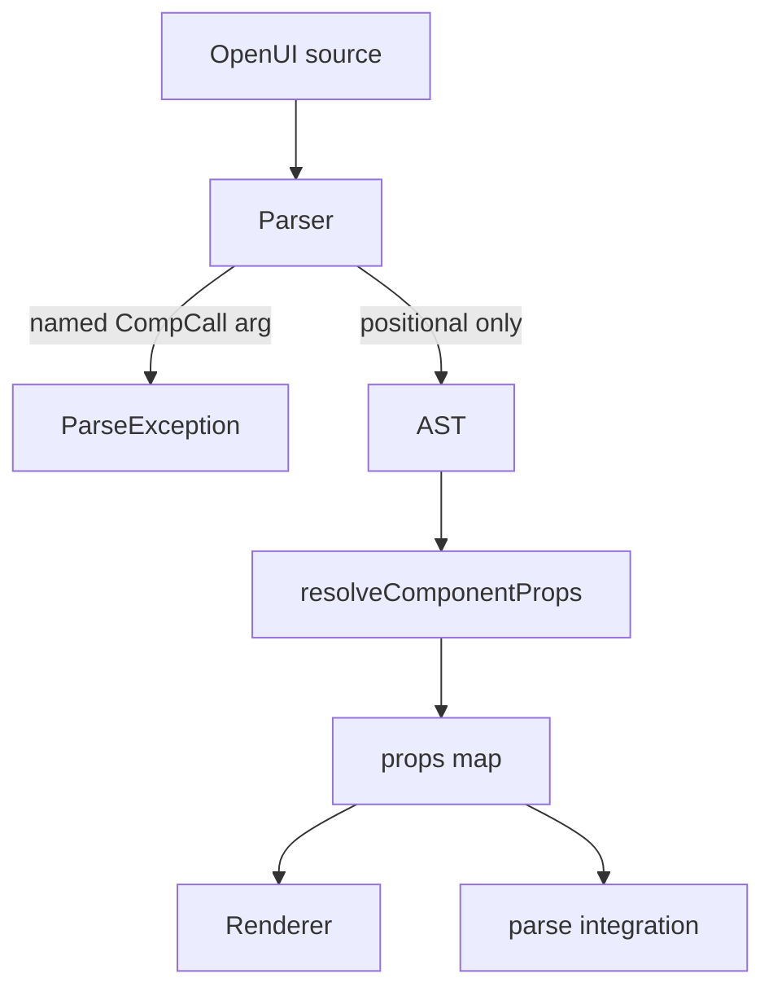

## feat: positional-only component args — Standard plan

## Overview

Implement **positional-only** component calls on the primary render path and reject named component args at parse time. Unify prop resolution in `library.dart` so `evaluateElementProps`, `Renderer._resolveProps`, and integration `parse()` behave identically. Migrate prompts, examples, and `lang-reference.md` in the same change.

**Brainstorm:** [2026-05-23-positional-component-args-parity-brainstorm-doc.md](../brainstorm/2026-05-23-positional-component-args-parity-brainstorm-doc.md)

**Phase 1 (this plan):** syntax + mapping machinery using **Dart `Schema.object` property insertion order**.

**Phase 2 (follow-up issue):** reorder schemas to match canonical Zod order so canonical paste binds correctly (`Stack`, `Button`, etc.).

## Problem Statement / Motivation

Canonical OpenUI v0.5 uses **positional-only** component arguments mapped by schema key order. LLM output from the JS stack does not use `label:`, `text:`, etc.

Today in `openui_flutter`:

- Parser accepts both forms.
- Integration `parse()` maps positionals via `ParamMap`.
- **`evaluateElementProps` / `Renderer` drop positional args** (`if (propName == null) continue`).
- Prompts teach `Type(named: value, ...)`.

See [canonical-comparison.md](../canonical-comparison.md) §2.1, §3.4 and test `positional args are dropped` in `library_test.dart`.

## Proposed Solution

### 1. Shared positional binding (`library.dart`)

**Single source of prop order:** `schema.value['properties']` key iteration order (Dart insertion order). Add `orderedPropertyNames(Schema schema)` only if used in 3+ call sites.

**Two-layer API (avoid over-abstracting):**

1. **`bindPositionalProps`** (private or `@internal`) — index positional `Argument`s to prop names; call per-slot `resolveValue(arg, propName)`.
2. **`evaluateElementProps`** — uses `bindPositionalProps` + `evaluate` / `ReactiveAssign` (existing logic).
3. **`Renderer._resolveProps`** — uses same `bindPositionalProps` + `_resolvePropValue` / `actionPlanFromAst` / streaming incomplete handling (cannot blindly delegate to `evaluateElementProps` alone).

**`parse()` contract (critical):** Integration `parse()` today orders by **`ParamMap` / `ParamSpec`**, not full schema. To satisfy parity:

- Add `paramMapFromLibrary(LibraryDefinition)` (or pass `Map<String, Schema>` into `parse()`) so `ParamSpec` order matches schema property order; **or**
- Extend `parse()` to accept schemas and derive `ParamSpec` from `Schema` (required + defaults).

`_materializeComp` calls `bindPositionalProps` with order from **the same list** used for `missing-required` validation; **remove** named-arg overlay loop.

**Lenient:** ignore positionals beyond property count on **both** render and integration paths (no `excess-args` error).

### 2. Parse-time validation (mirror `@Query` / `@Each`)

Add `validateComponentArgShape(Statement, {committedOffsetBoundary})` in `parser.dart`:

- Walk AST; for each `CompCall`, if any `arg.name != null` → `ParseException` with message like: `component arguments must be positional; named arguments are not supported`.
- Recurse into `CompCall` children, `@Each` templates, arrays, ternaries (same pattern as `_collectEachShapeErrors`).
- Wire into `Parser.parseProgram` / `StreamParser` committed-statement validation alongside `validateQueryShape`.

**Do not** change `_parseArgList` globally — builtins, `MutationCall`, and object literals still use `ident: expr`.

### 3. Prompts and docs

| File | Change |
|------|--------|
| `packages/openui_core/lib/src/prompt/prompt.dart` | Grammar: `Type(arg1, arg2, ...)` positional-only; `@Each` example without `Card(title: row.name)`; `x-action` example uses positional slot; update `_formatComponentSignature` to show **positional** order (property key order), not `name: type` pairs |
| `docs/lang-reference.md` | EBNF: component `arg_list` positional only; builtins/mutation keep `named_arg` |
| `docs/canonical-comparison.md` | Mark positional gap **fixed** (with phase-2 schema-order caveat) |
| `apps/openui_flutter_example/assets/scripts/*.txt` | Rewrite all five scripts to positional |
| Component / renderer tests | Same migration |

### 4. Lenient excess — behavior change

**Today:** `parse_test.dart` `excess-args` group expects `EvaluationError` with `excess dropped` but still renders.

**Target:** no error; silently ignore extra positionals. Update or remove `excess-args` tests.

### 5. Phase-2 artifact (plan deliverable, implement in follow-up PR)

Add `docs/plan/positional-args-schema-order.md` (or table in this plan’s appendix) listing all **17 shipped** components:

| Component | Dart slot order (phase 1) | Canonical order | Safe canonical paste? |
|-----------|---------------------------|-----------------|------------------------|
| `Stack` | `direction`, `gap`, …, `children` | `children`, `direction`, … | **No** |
| `TextContent` | `text`, `size` | `text`, `size` | Verify |
| `Button` | `label`, `variant`, `onClick` | `label`, `action`, `variant` | **No** (also `action` prop name) |
| … | … | … | … |

Populate from `packages/openui_components/lib/src/components/*.dart` vs `openuiLibrary.tsx`.

## Technical Considerations

### Architecture

- Single resolver in `openui_core` keeps `openui` Renderer aligned with integration `parse()`.
- `Renderer` does not use integration `parse()` today — fixing `evaluateElementProps` is **required** for example app and streaming render.

### Defaults and required props

| Path | Missing optional | Missing required |
|------|------------------|------------------|
| Integration `parse()` | `ParamSpec.defaultValue` / schema | `missing-required` error, drop element |
| Renderer | Widget null-coalescing (`variant ?? 'primary'`) | No `ParamSpec` — may render with empty/null |

**Decision:** Resolver does not need to duplicate `ParamSpec` defaults on render path if widgets already coalesce; **must** document in tests. Integration `parse()` keeps existing required validation.

### `x-reactive` / `x-action`

Apply special handling to the prop name at each index (same as today’s named-path logic in `evaluateElementProps` and `_resolveProps`).

Example (Dart order): `Button("OK", [@Set($x, 1)], "primary")` → `label`, `variant` gets action array, `onClick` never set — **wrong until schema reorder**. Document in migration notes; fix in phase 2.

### Streaming

`validateComponentArgShape` must respect `committedOffsetBoundary` (same as `@Query`) so incomplete `Button(label` chunks do not false-positive until committed — if needed, only validate args when `)` closes or statement is committed.

### Performance

Negligible: O(args × props) per component; same as today’s arg loop.

### Security

None.

## Implementation tasks

### Phase A — Core binding

- [ ] **A1** Add `bindPositionalProps` in `library.dart` (index map + lenient excess).
- [ ] **A2** Refactor `evaluateElementProps` to use `bindPositionalProps` (preserve `ReactiveAssign`).
- [ ] **A3** Refactor `Renderer._resolveProps` to use `bindPositionalProps` + existing action/streaming `resolveValue` path.
- [ ] **A4** Add `paramMapFromLibrary` (or schema-aware `parse()` overload) so `ParamSpec` order ≡ schema property order.
- [ ] **A5** Refactor `_materializeComp` to use `bindPositionalProps`; remove named overlay; keep `ParamSpec` validation pass.
- [ ] **A6** Spike: confirm `Schema.object` property key order is stable (no reorder on `toJson` round-trip).

### Phase B — Parser validation

- [ ] **B1** Add `validateComponentArgShape` + `_collectComponentArgShapeErrors` in `parser.dart` (mirror `@Each` walk; no generic validator framework).
- [ ] **B2** Integrate into full parse and `StreamParser` committed validation (`committedOffsetBoundary` like `@Query`).
- [ ] **B3** `parser_test.dart`: reject `Button(label: "x")`, `Stack(children: [])`, mixed `Stack(a, b: 1)`; accept `@Query(x, y: 1)`; nested positional `CompCall` only.
- [ ] **B4** `streaming_test.dart`: committed statement with named component arg errors; avoid false positives on uncommitted tails (add only if B2 reproduces a failure).

### Phase C — Tests

- [ ] **C1** Flip `library_test.dart` `positional args are dropped` → binds by schema order (`TextContent("a", "b")` → `text`, `size`).
- [ ] **C2** Parity test: same `CompCall` + schema + **literal args** → identical bound props from `evaluateElementProps` and `parse()` (document AST vs evaluated value difference).
- [ ] **C3** Update `parse_test.dart` `excess-args` → no error, extras ignored.
- [ ] **C4** Remove/replace obsolete `library_test` cases that assume named `CompCall` extras pass through.
- [ ] **C5** Renderer test: positional `onClick` slot + `[@Set(...)]`; streaming incomplete disables action (A6).
- [ ] **C6** `prompt_test.dart`: positional grammar, positional signatures, no `Card(title: row.name)` in `@Each` example.
- [ ] **C7** Example/widget test: positional `02_counter`-style script (use **verified** arg order per `button.dart` — see migration hazards).
- [ ] **~~C5 canonical golden~~** — **Deferred to phase 2** (canonical paste mis-binds until schema reorder).

### Phase D — Migration surface

- [ ] **D1** Rewrite `apps/openui_flutter_example/assets/scripts/*.txt` (5 files).
- [ ] **D2** Update `prompt.dart` grammar, rules, `_formatComponentSignature` (positional signatures).
- [ ] **D3** Update `docs/lang-reference.md`.
- [ ] **D4** Grep `packages/**/test`, `apps/**` for named `CompCall` patterns (`label:`, `children:`, `text:`) — not only `.txt` assets.
- [ ] **D5** Update `docs/canonical-comparison.md` parity table + `packages/openui_core/CHANGELOG.md` breaking note.
- [ ] **D6** `_formatComponentSignature`: emit positional order, e.g. `Button(string label, string? variant, onClick)` — not `label: type` pairs.

### Phase E — Phase-2 prep (minimal in this PR)

- [ ] **E1** In `canonical-comparison.md`, list **known mismatches only** (`Stack`, `Button`, …) + link to follow-up issue (defer full 17-row table).
- [ ] **E2** File follow-up issue: canonical schema property order per §5.3 (generate table in that issue from `openuiLibrary.tsx` vs Dart schemas).

## Acceptance Criteria

- [ ] `TextContent("hi", "large-heavy")` resolves `{text: "hi", size: "large-heavy"}` via `evaluateElementProps` and full `Renderer`.
- [ ] `Button(label: "x")` fails at parse with clear error; no silent ignore.
- [ ] Extra positionals do not produce `EvaluationError` on integration `parse()`.
- [ ] `parse()` and `evaluateElementProps` produce identical props maps for the same AST + schema.
- [ ] All example `.txt` assets parse and render under positional-only syntax.
- [ ] `generatePrompt` output documents positional-only component calls and positional component signatures.
- [ ] Builtins (`@Query`, `@Each`, `@Run`) and object literals still accept named args.
- [ ] `canonical-comparison.md` updated; known schema-order mismatches documented (`Stack` example).
- [ ] `melos run test` / `test:flutter` pass for `openui_core`, `openui`, `openui_components`.

## Success Metrics

- Canonical **syntax** (positional-only) accepted on render path.
- In-repo named component examples eliminated.
- `positional args are dropped` test removed/replaced.

## Dependencies & Risks

| Risk | Mitigation |
|------|------------|
| `ParamMap` order ≠ schema order | A4 `paramMapFromLibrary` or schema-aware `parse()` |
| Dart schema order ≠ canonical | Phase-2 issue; short mismatch list in comparison doc |
| LLMs trained on named Flutter prompts | Prompt + examples migration in same PR |
| `Button` second positional = `variant` not `onClick` | Do not ship misleading counter examples; verify order or use 3-arg form |
| Renderer vs `parse()` default divergence | Document; test widget fallbacks |
| Streaming false positives on `label:` | B2 `committedOffsetBoundary`; B4 only if needed |

## Technical review notes (2026-05-23)

- **PR scope:** Single PR recommended (hard break + migration tightly coupled).
- **Simplicity:** Defer full schema-order matrix (E1) and canonical golden (C5) to phase 2.
- **Pre-build:** Resolve Schema/`ParamMap` contract (A4) before C2 parity tests.

## References & Research

| Topic | Path |
|-------|------|
| Gap (drop positionals) | `packages/openui_core/lib/src/library/library.dart:54-68` |
| Renderer duplicate | `packages/openui/lib/src/renderer.dart:536-567` |
| Working positional map | `packages/openui_core/lib/src/parse/parse.dart:440-465` |
| Query validation pattern | `packages/openui_core/lib/src/parser/parser.dart:200-225` |
| Prompt (named today) | `packages/openui_core/lib/src/prompt/prompt.dart:23-24` |
| Comparison doc | `docs/canonical-comparison.md` |
| Canonical spec | https://www.openui.com/docs/openui-lang/specification-v05 |

## Appendix: Example migrations

**Before (`02_counter.txt`):**

```text
TextContent(text: "Count: " + $count, size: "large-heavy")
Button(label: "Increment", onClick: [@Set($count, $count + 1)])
```

**After (Dart schema order — verify per component):**

```text
TextContent("Count: " + $count, "large-heavy")
Button("Increment", [@Set($count, $count + 1)])
```

**Button migration (current schema `label`, `variant`, `onClick`):**

```text
Button("Increment", "primary", [@Set($count, $count + 1)])
Button("Reset", "secondary", [@Reset($count)])
```

Do **not** use two-arg `Button("Increment", [@Set(...)])` — the action array would bind to `variant`. Phase 2 reorders schema to canonical `label`, `action`, `variant`.

## Appendix: Flow diagram


